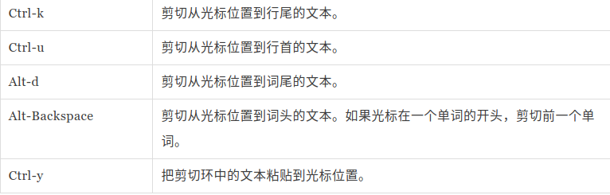
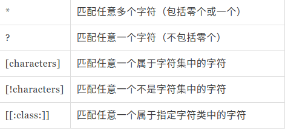
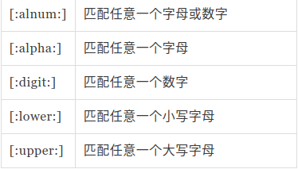
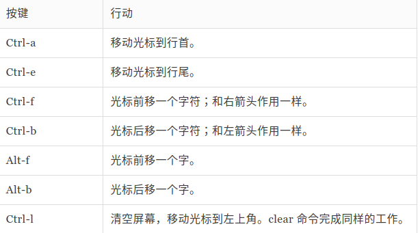

## 什么是shell?

shell 就是一个程序，它接受从键盘输入的命令， 然后把命令传递给操作系统去执行。
[me@linuxbox ~]$
提示符的最后一个字符是“#”,终端会话就有超级用户权限。以 root 用户的身份登录 / 选择的终端仿真器提供超级用户（管理员）权限。
df   磁盘剩余空间的数量
free 空闲内存的数量
exit 结束终端

## 文件系统中跳转

ls 目录包含的文件及子目录
cd 进入指定文件： 绝对路径：“/”根目录开始，相对路径：“.”(可省略) 工作目录，”..” 工作目录的父目录

以 “.” 字符开头的文件名是隐藏文件，ls 命令不能列出它们，  ls -a 命令
不可忽略大小写

## 探究操作系统

ls 目录包含的文件及子目录
ls ~ /usr  列出(多个)指定目录的内容
ls -a (--all) 列出所有文件，甚至包括文件名以圆点开头的默认会被隐藏的隐藏文件。
ls -t 按照修改时间来排序
ls -S 按照文件大小来排序
ls -r (--reverse) 以相反的顺序来显示结果
ls -l 以长格式显示结果(长格式？)
ls -h 可读的格式列出
ls -li 文件索引节点信息（硬链接索引节点相同）
file filename 打印出文件内容的简单描述
less filename 浏览文件内容(q 退出)

## 操作文件和目录

cp — 复制文件和目录
mv — 移动/重命名文件和目录
mkdir — 创建目录
rm — 删除文件和目录
ln — 创建硬链接 硬链接不能跨越物理设备， 硬链接不能关联目录，只能是文件
ln -s - 创建符号链接

## 使用命令

type – 说明怎样解释一个命令名
which – 显示会执行哪个可执行程序
man – 显示命令手册页
apropos – 显示一系列适合的命令
info – 显示命令 info
whatis – 显示一个命令的简洁描述
alias – 创建命令别名(alias name='string' unalias name)
help － 得到 shell 内建命令的帮助文档
--help - 显示用法信息

## 重定向

cat － 连接文件
sort － 排序文本行
uniq － 报道或省略重复行
grep － 打印匹配行
head － 输出文件第一部分 tail - 输出文件最后一部分 (两个命令 都打印十行文本，可以通过”-n”选项来调整命令打印的行数。)
tee - 从标准输入读取数据，并同时写到标准输出和文件
标准输出重定向: ls -l /test > ls-output.txt(当目录错误时，ls 程序不把它的错误信息输送到标准输出，使用 “>” 重定向符来重定向输出结果时，目标文件总是从开头被重写。
使用”>>“操作符，将导致输出结果添加到文件内容之后。如果文件不存在，文件会 被创建)
标准错误重定向 :ls -l /error 2> ls-error.txt
重定向标准输出和错误到同一个文件: 1. ls -l /bin/usr > ls-output.txt 2>&1 2. ls -l /bin/usr &> ls-output.txt
标准输入重定向: cat lazy_dog.txt (Ctrl-d结束)  重定向标准输入： cat < lazy_dog.txt
管道： ls -l /usr/bin | less （命令从标准输入读取数据并输送到标准输出的能力被一个称为管道线的 shell 特性所利用。
使用管道操作符”|”，一个命令的标准输出可以通过管道送至另一个命令的标准输入）
 wc － 打印行数、字数和字节数(”-l”选项限制命令输出只能 报道行数)

## 从 shell 眼中看世界

echo － 显示一行文本 (是一个 shell 内建命令，将它的文本参数打印到标准输出中。)
算术表达式展开： echo $((expression))
花括号展开: echo Front-{A,B,C}-Back   --> Front-A-Back Front-B-Back Front-C-Back
参数展开: echo $USER   (查看有效变量列表： printenv | less)
命令替换： echo $(ls)
文本放在双引号中， shell 使用的特殊字符，都失去它们的特殊含义，被当作普通字符来看待。 例外： $，\ (反斜杠），和 `（倒引号）。参数展开、算术表达式展开和命令替换仍然有效
单引号：禁止所有的展开

## 键盘高级操作技巧

clear － 清空屏幕
history － 显示历史列表内容

## vi 简介

启动 vi: vi
退出 vi: :q  /  :q!
Esc退出插入模式
i： 插入文本
a : 追加文本
A : 光标将移动到行尾，同时 vi 进入输入模式。
o ： 当前行的下方打开一行。
O ： 当前行的上方打开一行
yy : 复制当前行
d : 剪切
p / P ： 粘贴（光标前、光标后）
J : 连接行
编辑多个文件：vi file1 file2 file3...
:n :N  切换下一个文件 / 回到先前的文件
