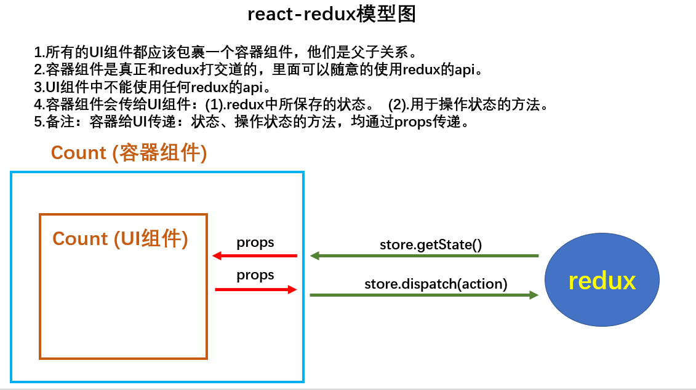

# 状态管理JS库，集中式管理应用中多个组件共享的状态




```js
一.Redux核心概念(action,store,reducer)
1.action(动作的对象)
包含2个属性
type：标识属性, 值为字符串, 唯一, 必要属性
data：数据属性, 值类型任意, 可选属性
例子：{ type: 'ADD_STUDENT',data:{name: 'tom',age:18} } (type:@@init@@初始化 )
Object 同步acrion / function 异步action(函数能开启异步任务)
2.reducer
用于初始化状态、加工状态。
加工时，根据旧的state和action， 产生新的state的纯函数。
3.store
将state、action、reducer联系在一起的对象
如何得到此对象?
1) import {createStore} from 'redux'
2) import reducer from './reducers'
3) const store = createStore(reducer)
此对象的功能?
1) getState(): 得到state
2) dispatch(action): 分发action, 触发reducer调用, 产生新的state
3) subscribe(listener): 注册监听, 当产生了新的state时, 自动调用
二.redux使用
(1).去除Count组件自身的状态
(2).src下建立:
       -redux
         -store.js
         -count_reducer.js
(3).store.js：
    1).引入redux中的createStore函数，创建一个store
    2).createStore调用时要传入一个为其服务的reducer
    3).暴露store对象
//引入createStore，专门用于创建redux中最为核心的store对象
import {createStore} from 'redux'
//引入为Count组件服务的reducer
import countReducer from './count_reducer'
//暴露store
export default createStore(countReducer)
(4).count_reducer.js：
          1).reducer的本质是一个函数，接收：preState,action，返回加工后的状态
          2).reducer有两个作用：初始化状态，加工状态
         3).reducer被第一次调用时，是store自动触发的，
                   传递的preState是undefined,
                    传递的action是:{type:'@@REDUX/INIT_a.2.b.4}
/*
    1.该文件是用于创建一个为Count组件服务的reducer，reducer的本质就是一个函数
    2.reducer函数会接到两个参数，分别为：之前的状态(preState)，动作对象(action)
*/
const initState = 0 //初始化状态
export default function countReducer(preState=initState,action){
    //从action对象中获取：type、data
    const {type,data} = action
    //根据type决定如何加工数据
    switch (type) {
        case 'increment': //如果是加
            return preState + data
        case 'decrement': //若果是减
            return preState - data
        default:
            return preState
    }
}
 (5).在index.js中监测store中状态的改变，一旦发生改变重新渲染<App/>
        store.subscribe(()=>{
 				 ReactDOM.render(<App/>,document.getElementById('root'))
    		})
 备注：redux只负责管理状态，至于状态的改变驱动着页面的展示，要靠我们自己写。

             1.count_action.js 专门用于创建action对象
            2.constant.js 放置容易写错的type值
三,异步action
(1).延迟的动作不想交给组件自身， 想交给action
(2).何时需要异步action：想要对状态进行操作，但是具体的数据靠异步任务返回。
(3).具体编码：
    1).yarn add redux-thunk，并配置在store中
    2).创建action的函数不再返回一般对象，而是一个函数，该函数中写异步任务。
    3).异步任务有结果后，分发一个同步的action去真正操作数据。
(4).备注：异步action不是必须要写的，完全可以自己等待异步任务的结果了再去分发同步action。

//异步action，就是指action的值为函数,异步action中一般都会调用同步action，异步action不是必须要用的。
export const createIncrementAsyncAction = (data,time) => {
    return (dispatch)=>{
        setTimeout(()=>{
            dispatch(createIncrementAction(data))
        },time)
    }
}

//引入createStore，专门用于创建redux中最为核心的store对象
import {createStore,applyMiddleware} from 'redux'
//引入为Count组件服务的reducer
import countReducer from './count_reducer'
//引入redux-thunk，用于支持异步action
import thunk from 'redux-thunk'
//暴露store
export default createStore(countReducer,applyMiddleware(thunk))

index.js:
/*此处需要用Provider包裹App，目的是让App所有的后代容器组件都能接收到store*/
    import {Provider} from 'react-redux'
    <Provider store={store}>
        <App/>
    </Provider>,

组件：
import {connect} from 'react-redux'  //引入connect用于连接UI组件与redux
import { addAction } from '../redux/action'
class Count extends Component{
    add = ()=>{
        this.props.action()
    }
    render(){
        <div>this.props.state</div>
    }
}
//使用connect()()创建并暴露一个Count的容器组件,第一个参数映射状态，第二个参数映射操作状态的方法，
//回调传ui组件
export default connect(
    state =>({count:state.he,person:state.rens}),
    {
        action:addAction
    }
)(Count)

store: //该文件专门用于暴露一个store对象，整个应用只有一个store对象
//引入createStore，专门用于创建redux中最为核心的store对象
import {createStore,applyMiddleware,combineReducers} from 'redux'
//引入为Count组件服务的reducer
import countReducer from './reducers/count'
//引入为Count组件服务的reducer
import personReducer from './reducers/person'
//引入redux-thunk，用于支持异步action
import thunk from 'redux-thunk'

//汇总所有的reducer变为一个总的reducer
const allReducer = combineReducers({
    he:countReducer,
    rens:personReducer
})
//暴露store
export default createStore(allReducer,applyMiddleware(thunk))
reducer:
    1.该文件是用于创建一个为Count组件服务的reducer，reducer的本质就是一个函数
    2.reducer函数会接到两个参数，分别为：之前的状态(preState)，动作对象(action)

import {INCREMENT,DECREMENT} from '../constant'
const initState = 0 //初始化状态
export default function countReducer(preState=initState,action){//必须是一个纯函数
    //从action对象中获取：type、data
    const {type,data} = action
    //根据type决定如何加工数据
    switch (type) {
        //如果返回的内容和preState一样则不进行刷新（浅比较）
        case INCREMENT: //如果是加
            return preState + data
        case DECREMENT: //若果是减
            return preState - data
        default:
            return preState
    }}
action: //该文件专门为Count组件生成action对象
import {INCREMENT,DECREMENT} from './constant'
//同步action，就是指action的值为Object类型的一般对象
export const createIncrementAction = data => ({type:INCREMENT,data})
export const createDecrementAction = data => ({type:DECREMENT,data})

//异步action，就是指action的值为函数,异步action中一般都会调用同步action，异步action不是必须要用的。
export const createIncrementAsyncAction = (data,time) => {
    return (dispatch)=>{
        setTimeout(()=>{
            dispatch(createIncrementAction(data))
        },time)
    }
}

react-redux开发者工具的使用
            (1).yarn add redux-devtools-extension
            (2).store中进行配置
                    import {composeWithDevTools} from 'redux-devtools-extension'
                    const store = createStore(allReducer,composeWithDevTools(applyMiddleware(thunk)))
```
