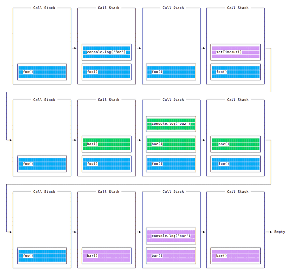

## Node.js 包运行器 npx

- npx 可以运行使用 Node.js 构建并通过 npm 仓库发布的代码。
- npx 无需先安装命令即可运行命令。
    - 不需要安装任何东西。
    - 可以使用 @version 语法运行同一命令的不同版本。
    - 运行 vue CLI 工具以创建新的应用程序并运行它们：`npx @vue/cli create my-vue-app`。
    - 使用 create-react-app 创建新的 React 应用：`npx create-react-app my-react-app`。

## Node.js 事件循环

### 介绍

- Node.js 是异步且具有非阻塞的 I/O
- Node.js JavaScript 代码运行在单个线程上。 每次只处理一件事。

### 阻塞事件循环

- 任何花费太长时间才能将控制权返回给事件循环的 JavaScript 代码，都会阻塞页面中任何 JavaScript 代码的执行，甚至阻塞 UI 线程，并且用户无法单击浏览、滚动页面等。
- JavaScript 中几乎所有的 I/O 基元都是非阻塞的。 网络请求、文件系统操作等。 被阻塞是个异常，这就是 JavaScript 如此之多基于回调（最近越来越多基于 promise 和 async/await）的原因。

### 调用堆栈

- 调用堆栈是一个 LIFO 队列（后进先出）。
- 事件循环不断地检查调用堆栈，以查看是否需要运行任何函数。
- 当执行时，它会将找到的所有函数调用添加到调用堆栈中，并按顺序执行每个函数。

### 入队函数执行

```js
const bar = () => console.log('bar')
const baz = () => console.log('baz')
const foo = () => {
  console.log('foo')
  setTimeout(bar, 0)
  baz()
}
foo()
```

- 当运行此代码时，会首先调用 foo()。 在 foo() 内部，会首先调用 setTimeout，将 bar 作为参数传入，并传入 0 作为定时器指示它尽快运行。 然后调用 baz()。


### 消息队列

- 当调用 setTimeout() 时，浏览器或 Node.js 会启动定时器。 当定时器到期时（在此示例中会立即到期，因为将超时值设为 0），则回调函数会被放入“消息队列”中。
- 在消息队列中，用户触发的事件（如单击或键盘事件、或获取响应）也会在此排队，然后代码才有机会对其作出反应。 类似 onLoad 这样的 DOM 事件也如此。
- 事件循环会赋予调用堆栈优先级，它首先处理在调用堆栈中找到的所有东西，一旦其中没有任何东西，便开始处理消息队列中的东西。
- 不必等待诸如 setTimeout、fetch、或其他的函数来完成它们自身的工作，因为它们是由浏览器提供的，并且位于它们自身的线程中。

### ES6 作业队列

- ECMAScript 2015 引入了作业队列的概念，Promise 使用了该队列。 这种方式会尽快地执行异步函数的结果，而不是放在调用堆栈的末尾。
- 在当前函数结束之前 resolve 的 Promise 会在当前函数之后被立即执行。

```js
const bar = () => console.log('bar')
const baz = () => console.log('baz')
const foo = () => {
  console.log('foo')
  setTimeout(bar, 0)
  new Promise((resolve, reject) =>
    resolve('应该在 baz 之后、bar 之前')
  ).then(resolve => console.log(resolve))
  baz()
}
foo()
// foo
// baz
// 应该在 baz 之后、bar 之前
// bar
```

## process.nextTick()

- 每当事件循环进行一次完整的行程时，称为一个滴答。
- 当将一个函数传给 process.nextTick() 时，则指示引擎在当前操作结束（在下一个事件循环滴答开始之前）时调用此函数：

```js
process.nextTick(() => {
  //做些事情
})
```

## setImmediate()

- 当要异步地（但要尽可能快）执行某些代码时，其中一个选择是使用 Node.js 提供的 setImmediate() 函数：

```js
setImmediate(() => {
  //运行一些东西
})
```

- 作为 setImmediate() 参数传入的任何函数都是在事件循环的下一个迭代中执行的回调。
- setImmediate() 与 setTimeout(() => {}, 0)（传入 0 毫秒的超时）、process.nextTick() 有何不同？
- 传给 process.nextTick() 的函数会在事件循环的当前迭代中（当前操作结束之后）被执行。 这意味着它会始终在 setTimeout 和 setImmediate 之前执行。
- 延迟 0 毫秒的 setTimeout() 回调与 setImmediate() 非常相似。 执行顺序取决于各种因素，但是它们都会在事件循环的下一个迭代中运行。
