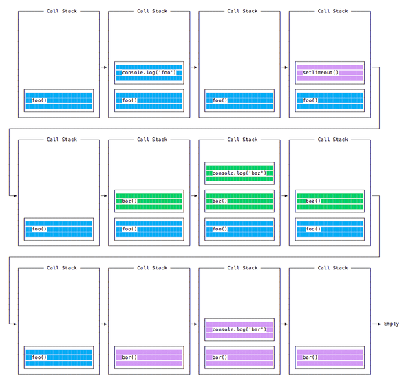
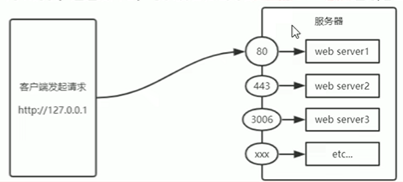

## Node.js 包运行器 npx

- npx 可以运行使用 Node.js 构建并通过 npm 仓库发布的代码。
- npx 无需先安装命令即可运行命令。
    - 不需要安装任何东西。
    - 可以使用 @version 语法运行同一命令的不同版本。
    - 运行 vue CLI 工具以创建新的应用程序并运行它们：`npx @vue/cli create my-vue-app`。
    - 使用 create-react-app 创建新的 React 应用：`npx create-react-app my-react-app`。

## Node.js 事件循环

### 介绍

- Node.js 是异步且具有非阻塞的 I/O
- Node.js JavaScript 代码运行在单个线程上。 每次只处理一件事。

### 阻塞事件循环

- 任何花费太长时间才能将控制权返回给事件循环的 JavaScript 代码，都会阻塞页面中任何 JavaScript 代码的执行，甚至阻塞 UI 线程，并且用户无法单击浏览、滚动页面等。
- JavaScript 中几乎所有的 I/O 基元都是非阻塞的。 网络请求、文件系统操作等。 被阻塞是个异常，这就是 JavaScript 如此之多基于回调（最近越来越多基于 promise 和 async/await）的原因。

### 调用堆栈

- 调用堆栈是一个 LIFO 队列（后进先出）。
- 事件循环不断地检查调用堆栈，以查看是否需要运行任何函数。
- 当执行时，它会将找到的所有函数调用添加到调用堆栈中，并按顺序执行每个函数。

### 入队函数执行

```js
const bar = () => console.log('bar')
const baz = () => console.log('baz')
const foo = () => {
  console.log('foo')
  setTimeout(bar, 0)
  baz()
}
foo()
```

- 当运行此代码时，会首先调用 foo()。 在 foo() 内部，会首先调用 setTimeout，将 bar 作为参数传入，并传入 0 作为定时器指示它尽快运行。 然后调用 baz()。


### 消息队列

- 当调用 setTimeout() 时，浏览器或 Node.js 会启动定时器。 当定时器到期时（在此示例中会立即到期，因为将超时值设为 0），则回调函数会被放入“消息队列”中。
- 在消息队列中，用户触发的事件（如单击或键盘事件、或获取响应）也会在此排队，然后代码才有机会对其作出反应。 类似 onLoad 这样的 DOM 事件也如此。
- 事件循环会赋予调用堆栈优先级，它首先处理在调用堆栈中找到的所有东西，一旦其中没有任何东西，便开始处理消息队列中的东西。
- 不必等待诸如 setTimeout、fetch、或其他的函数来完成它们自身的工作，因为它们是由浏览器提供的，并且位于它们自身的线程中。

### ES6 作业队列

- ECMAScript 2015 引入了作业队列的概念，Promise 使用了该队列。 这种方式会尽快地执行异步函数的结果，而不是放在调用堆栈的末尾。
- 在当前函数结束之前 resolve 的 Promise 会在当前函数之后被立即执行。

```js
const bar = () => console.log('bar')
const baz = () => console.log('baz')
const foo = () => {
  console.log('foo')
  setTimeout(bar, 0)
  new Promise((resolve, reject) =>
    resolve('应该在 baz 之后、bar 之前')
  ).then(resolve => console.log(resolve))
  baz()
}
foo()
// foo
// baz
// 应该在 baz 之后、bar 之前
// bar
```

## process.nextTick()

- 每当事件循环进行一次完整的行程时，称为一个滴答。
- 当将一个函数传给 process.nextTick() 时，则指示引擎在当前操作结束（在下一个事件循环滴答开始之前）时调用此函数：

```js
process.nextTick(() => {
  //做些事情
})
```

## setImmediate()

- 当要异步地（但要尽可能快）执行某些代码时，其中一个选择是使用 Node.js 提供的 setImmediate() 函数：

```js
setImmediate(() => {
  //运行一些东西
})
```

- 作为 setImmediate() 参数传入的任何函数都是在事件循环的下一个迭代中执行的回调。
- setImmediate() 与 setTimeout(() => {}, 0)（传入 0 毫秒的超时）、process.nextTick() 有何不同？
- 传给 process.nextTick() 的函数会在事件循环的当前迭代中（当前操作结束之后）被执行。 这意味着它会始终在 setTimeout 和 setImmediate 之前执行。
- 延迟 0 毫秒的 setTimeout() 回调与 setImmediate() 非常相似。 执行顺序取决于各种因素，但是它们都会在事件循环的下一个迭代中运行。

## Node.js 事件触发器

- Node.js 提供了 events 模块的EventEmitter 类，用于处理事件。

```js
const EventEmitter = require('events')
const eventEmitter = new EventEmitter()
```

## Node模块

### os模块可提供操作系统的一些基本信息

```js
const os = require("os");
const result = os.platform(); //查看操作系统平台
           //os.release(); 查看操作系统版本
           //os.type();  查看操作系统名称
           //os.arch();  查看操作系统CPU架构

console.log(result);
```

### process是一个全局内置对象，可以在代码中的任何位置访问此对象，这个对象代表node.js代码宿主的操作系统进程对象。

- 使用process对象可以截获进程的异常、退出等事件，也可以获取进程的当前目录、环境变量、内存占用等信息，还可以执行进程退出、工作目录切换等操作。

```js
process.cwd(); //查看应用程序当前目录
process.chdir("目录"); //改变应用程序目录
```

- stdout是标准输出流,它的作用就是将内容打印到输出设备上，console.log就是封装了它。

```js
console.log = function(d){
    process.stdout.write(d+'\n');
}
```

- stderr是标准错误流，用来打印错误信息 `process.stderr.write('error');`

## fs 模块

### 读取文件

- fs.readFile() 和 fs.readFileSync() 都会在返回数据之前将文件的全部内容读取到内存中。
- 大文件会对内存的消耗和程序执行的速度产生重大的影响。

```js
const fs = require('fs')

fs.readFile('/Users/joe/test.txt', 'utf8' , (err, data) => {
  if (err) {
    console.error(err)
    return
  }
  console.log(data)
})
// 或
try {
  const data = fs.readFileSync('/Users/joe/test.txt', 'utf8')
  console.log(data)
} catch (err) {
  console.error(err)
}
```

### 写入文件

```js
const fs = require('fs')

const content = '一些内容'

fs.writeFile('/Users/joe/test.txt', content, err => {
  if (err) {
    console.error(err)
    return
  }
  //文件写入成功(若文件之前存在则会fugai)。
})
// 或
try {
  const data = fs.writeFileSync('/Users/joe/test.txt', content)
  //文件写入成功。
} catch (err) {
  console.error(err)
}

```

## path 路径模块

```js
const path = require('path')

const notes = '/users/joe/notes.txt'

// dirname: 获取文件的父文件夹。
path.dirname(notes) // /users/joe

// basename: 获取文件名部分。
path.basename(notes) // notes.txt
path.basename(notes, path.extname(notes)) //notes

// extname: 获取文件的扩展名。
path.extname(notes) // .txt

// 当前文件所处目录
console.log(__dirname)

// path.join() ： 连接路径的两个或多个部分
path.join('/', 'users/a/', '../', 'notes.txt') // '/users/notes.txt'
path.join(__dirname, '/file.txt')
```

## http模块

- ip 地址：互联网上每天计算机的唯一地址
- 域名和域名服务器：ip 地址和域名是一一对应的，对应关系存放在域名服务器（DNS）中，域名服务器就是提供 ip 地址和域名地址之间的转换服务的服务器（127.0.0.1对应的域名就是localhost）
- 端口号：在一台电脑可运行多个 web 服务，每个服务都对应一个端口号，客服端发起的网络请求通过端口号可准确交给对应 web 服务进行处理(每个端口只能对应一个 web 服务，URL中的80端口可省略)
  

```js
const http = require('http')
// http 属性
http.METHODS // 列出 HTTP 所以方法
http.STATUS_CODES // 列出 HTTP 所有状态代码及其描述
http.globalAgent // 指向 Agent 对象的全局实例，该实例是 http.Agent 类的实例。用于管理 HTTP 客户端连接的持久性和复用，它是 Node.js HTTP 网络的关键组件。
```

### 创建 web 服务器

- 导入 http 模块
- 创建 web 服务实例
- 为服务器实例绑定 request 时间，监听客服端请求
- 启动服务器

```js
const http = require('http')
const server = http.createServer()
server.on('request', (req, res) => {
  // 客户端发请求就会触发 request 时间，从而调用此回调函数
  // req请求对象: 访问与客户端相关的数据或属性，req.url:客户端请求的url地址，req.method:客户端请求类型
  // res响应对象：访问与服务器相关的数据或属性，res.end(str):向客户端发送指定内容并结束这次请求
  res.setHeader('Content-Type','text/html; charset=utf-8');// 设置响应头，解决中文乱码问题
} )
server.listen(8080, () => {
  // 在8080端口启动服务器：127.0.0.1:8080
})
```
