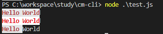

## qs

- qs.parse()将URL解析成对象的形式

```js
const Qs = require('qs');
let url = 'method=query_sql_dataset_data&projectId=85&appToken=7d22e38e-5717-11e7-907b-a6006ad3dba0';
Qs.parse(url);
console.log(Qs.parse(url));

{
    method: 'query_sql_dataset_data',
    projectId: '85',
    appToken: '7d22e38e-5717-11e7-907b-a6006ad3dba0'
}
```

- qs.stringify()将对象 序列化成URL的形式，以&进行拼接

```js
const Qs = require('qs');
let obj= {
     method: "query_sql_dataset_data",
     projectId: "85",
     appToken: "7d22e38e-5717-11e7-907b-a6006ad3dba0",
     datasetId: " 12564701"
   };
Qs.stringify(obj);
console.log(Qs.stringify(obj));

'method=query_sql_dataset_data&projectId=85&appToken=7d22e38e-5717-11e7-907b-a6006ad3dba0'
```

- 对数组的处理

```js
qs.stringify({ a: ['b', 'c', 'd'] }); // 'a[0]=b&a[1]=c&a[2]=d'
qs.stringify({ a: ['b', 'c', 'd'] }, { indices: false }); // 'a=b&a=c&a=d'

// 通过arrayFormat 选项进行格式化输出
qs.stringify({ a: ['b', 'c'] }, { arrayFormat: 'indices' }) // 'a[0]=b&a[1]=c'
qs.stringify({ a: ['b', 'c'] }, { arrayFormat: 'brackets' }) // 'a[]=b&a[]=c'
qs.stringify({ a: ['b', 'c'] }, { arrayFormat: 'repeat' }) // 'a=b&a=c'
```

- 对象的处理

```js
qs.stringify({ a: { b: 'c' } },{ allowDots: true }) //a.b=c
qs.stringify({ a: { b: 'c' } }) // a%5Bb%5D=c
```

## chalk

chalk 包的作用是修改控制台中字符串的样式

- 字体样式(加粗、隐藏等)
- 字体颜色
- 背景颜色

```js
const chalk = require('chalk');
console.log(chalk.red.bold.bgWhite('Hello World'));
console.log(chalk.rgb(255,0,0).bold.bgRgb(255,255,255)('Hello World'));
console.log(chalk`{red.bold.bgWhite Hello }World`);
```



## log-symbols

- 输出 info,success,warning,error 四种标识符

```js
const symbols = require('log-symbols')
console.log(symbols.info,symbols.success,symbols.warning,symbols.error)
```


## ora

ora 包用于显示加载中的效果，类似于页面的 loading 效果。

```js
import ora from 'ora';
const spinner = ora('Loading unicorns').start();
setTimeout(() => {
	spinner.color = 'yellow';
	spinner.text = 'Loading rainbows';
}, 1000);
```
