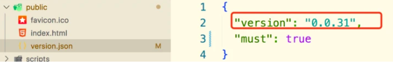

### 背景：项目修复了bug；但是客户端没有刷新浏览器；导致还是有bug的资源代码；出现了问题

后台管理系统是 标签页 形式；用户使用的时候会长期的保留几个正在使用的标签功能页；而且每一个都是keep-alive缓存的；切换的时候不会重新加载；导致的问题就是：如果用户就在A标签页进行操作；这个时候项目更新部署了新的代码；但是用户并没有刷新浏览器；所以他的页面依然是老的代码；就会出现不想要的结果

- 建立对比文件
    - vue项目中的 package.json 中存储当前打包资源的当前版本号

    ```json
    "name": "xxx",
    "version": "0.0.31"
    ```

    - 放置最新的版本号json （version.json）；放到public文件中放置webpack进行打包编译；并且维护一个辅助字段 must 代表是否必须强制刷新；当前默认 bug 级别才会强制刷新；优化和新功能不用强制刷新
    

- 获取对比文件
    - 获取两个版本号
    - 建立10秒一次的轮询定时器去轮询version.json文件；并且和本地资源的package.json对比；

    ```js
    const packageDate = require('../../package.json');
    axios.defaults.headers['Cache-Control'] = 'no-cache';
    const remotePackageDate = await axios.get(`http://${window.location.host}/version.json`);
    if(packageDate.version !== remotePackageDate.data.version && remotePackageDate.data.must){
        window.location.reload();
    }
    ```
