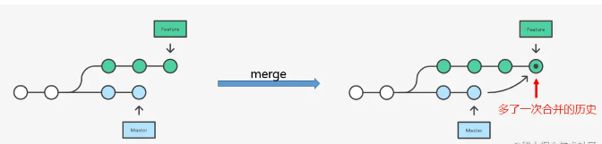
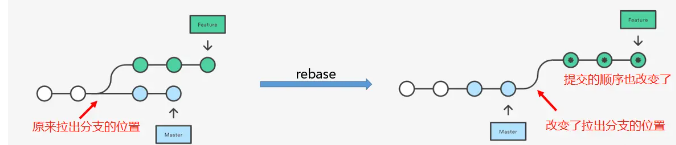

### git merge

- 将分支 feature 合并到分支 master
    

    ```shell
    git checkout master
    git merge feature
    ```

### git rebase

- 变基
    

    ```shell
    git checkout feature
    git rebase master
    ```

### git cherry pick

- 将代码从一个分支转移到另一个分支
    - 需要另一个分支的所有代码变动，采用合并（git merge）。
    - 需要部分代码变动（某几个提交），采用 Cherry pick。
- `git cherry-pick <commitHash>` 命令的作用，就是将指定的提交（commit）应用于其他分支。

```shell
a - b - c - d   Master
        \
        e - f - g Feature

# 将提交f应用到master分支

# 切换到 master 分支
$ git checkout master

# Cherry pick 操作
$ git cherry-pick f

# 操作完之后
a - b - c - d - f   Master
        \
        e - f - g Feature

# 将feature分支的最近一次提交，转移到当前分支
git cherry-pick feature
```

- 转移多个提交
    - `git cherry-pick <HashA> <HashB>` 将 A 和 B 两个提交应用到当前分支
    - `git cherry-pick A..B` 转移从 A 到 B 的所有提交
