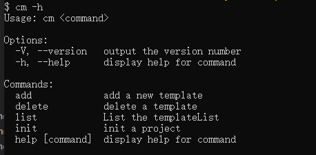

## 为什么需要脚手架

- 减少重复性的工作，不再从零创建一个项目，或者复制粘贴另一个项目的代码 。
- 根据动态交互生成项目结构和配置文件，具备更高的灵活性和人性化定制的能力 。
- 有利于多人开发协作，避免了人工传递文件的繁琐。
- 可以集成多套开发模板，根据项目需要选择合适的模板。

## 第三方库支持

- commander: 命令行工具
- download-git-repo: 用来下载远程模板
- inquirer: 交互式命令行工具
- ora: 显示 loading 动画
- chalk: 修改控制台输出内容样式
- log-symbols: 显示出 √ 或 × 等的图标
- handlebars.js 用户提交的信息动态填充到文件中

## 构建步骤

### 基本步骤

- 新建名为 `cm-cli` 的文件夹，执行 `yarn init -y` 初始化生成 `package.json` 文件
- 安装第三方工具库: `yarn add chalk commander download-git-repo inquirer ora log-symbols`
- 在根目录下新建一个 bin 文件夹，并在 bin 目录下新建一个无后缀名的 cm 文件,内容如下

    ```
    #!/usr/bin/env node
    console.log('hello world')
    ```

- 执行 `node ./bin/cm`， 在控制台会打印 `hello world`。
- 在 `package.json` 中进行命令配置

    ```json
    "bin": {
    "cm": "bin/cm"
    }
    ```

- 执行 `yarn link` 将命令挂载到全局, 执行 `cm` 相当于执行刚才的 `node ./bin/cm`

### 定义多个命令

#### [commander 常用命令](https://github.com/tj/commander.js/blob/master/Readme_zh-CN.md)

- usage(): 设置 usage 值
- command(): 定义一个命令名字
- description(): 设置 description 值
- option(): 定义参数，需要设置“关键字”和“描述”，关键字包括“简写”和“全写”两部分，以”,”,”|”,”空格”做分隔。
- parse(): 解析命令行参数 argv
- action(): 注册一个 callback 函数
- version() : 终端输出版本号

#### 脚手架命令

- add 新增一个项目模板
- delete 删除一个项目模板
- list 列举所以项目模板
- init 初始化一个项目模板

#### 实现

- `cm` 文件

```js
#!/usr/bin/env node
const program = require('commander')

program.usage('<command>')

program.version(require('../package').version)

program
  .command('add')
  .description('add a new template')
  .action(() => {
    require('../commands/add')
  })

program
  .command('init')
  .description('init a project')
  .action(() => {
    require('../commands/init')
  })

program.parse(process.argv)
```

- 此时执行 `cm -h` 出现如下效果



- 修改 `package.json` 配置

```json
"bin": {
  "cm-add": "bin/cm-add",
  "cm-init": "bin/cm-init"
}
```

- `yarn unlink` 解绑全局命令，再执行 `yarn link` 重新把命令绑定到全局，后可以直接使用 `cm add` 等命令。

## 编写指令

### inquirer 用法

- type：表示提问的类型，包括：input, confirm, list, rawlist, expand, checkbox, password, editor；
- name: 存储当前问题回答的变量；
- message：问题的描述；
- default：默认值；
- choices：列表选项，在某些 type 下可用，并且包含一个分隔符(separator)；
- validate：对用户的回答进行校验；
- filter：对用户的回答进行过滤处理，返回处理后的值；
- when：根据前面问题的回答，判断当前问题是否需要被回答；
- prefix：修改 message 默认前缀；
- suffix：修改 message 默认后缀。

```js
const inquirer = require('inquirer')

const question = [
  // 具体交互内容
]

inquirer.prompt(question).then((answers) => {
  console.log(answers) // 返回的结果
})
```

example:

```js
#!/usr/bin/env node
const inquirer = require('inquirer')

let question = [
  {
    name: "name",
    type: 'input',
    message: "请输入模板名称",
    validate (val) {
      if (!val) {
        return 'Name is required!'
      } else {
        return true
      }
    }
  },
  {
    name: "url",
    type: 'input',
    message: "请输入模板地址",
    validate (val) {
      if (val === '') return 'The url is required!'
      return true
    }
  }
]
inquirer
  .prompt(question).then(answers => {
    let { name, url } = answers;
    console.log(name, url)
  })

```
