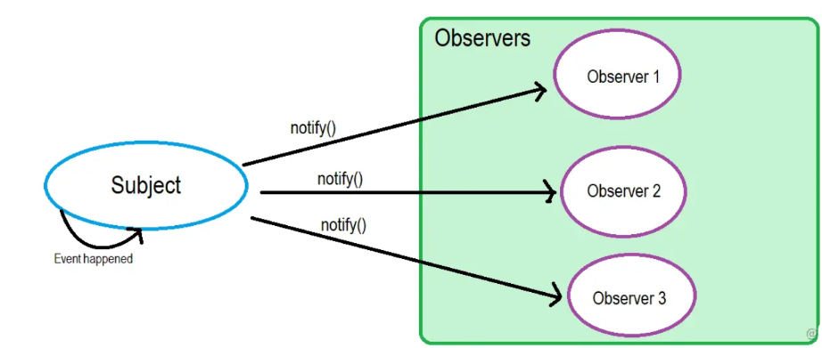
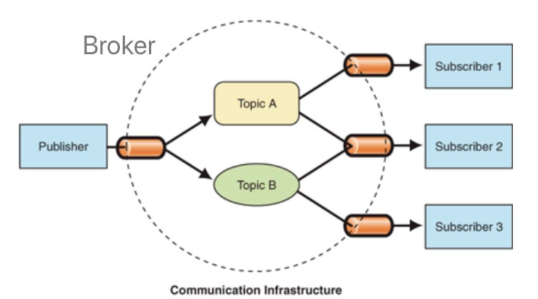

## 观察者模式

- 观察者模式定义了对象间的一种一对多的依赖关系，当一个对象的状态发生改变时，所有依赖于它的对象都将得到通知，并自动更新



```js
// 被观察者
class Subject {
  constructor() {
    this.observerList = [];
  }
  addObserver(observer) {
    this.observerList.push(observer);
  }
  removeObserver(observer) {
    const index = this.observerList.findIndex(o => o.name === observer.name);
    this.observerList.splice(index, 1);
  }
  notifyObservers(message) {
    const observers = this.observerList;
    console.log(observers)
    observers.forEach(observer => observer.notified(message));
  }
}
// 观察者
class Observer {
  constructor(name, subject) {
    this.name = name;
    if (subject) {
      subject.addObserver(this);
    }
  }
  notified(message) {
    console.log(this.name, 'got message', message);
  }
}
// 使用
const subject = new Subject();
const observerA = new Observer('observerA', subject);// 观察者主动申请加入被观察者的列表
const observerB = new Observer('observerB');
subject.addObserver(observerB); // 被观察者主动将观察者加入列表
subject.notifyObservers('Hello from subject');
subject.removeObserver(observerA);
subject.notifyObservers('Hello again');
```

## 发布订阅模式

- 发布-订阅是一种消息范式，消息的发送者（称为发布者）不会将消息直接发送给特定的接收者（称为订阅者）。而是将发布的消息分为不同的类别，无需了解哪些订阅者可能存在。



```js
// 订阅中心
class PubSub {
  constructor() {
    this.messages = {};
    this.listeners = {};
  }
  // 添加发布者
  publish(type, content) {
    const existContent = this.messages[type];
    if (!existContent) {
      this.messages[type] = [];
    }
    this.messages[type].push(content);
  }
  // 添加订阅者
  subscribe(type, cb) {
    const existListener = this.listeners[type];
    if (!existListener) {
      this.listeners[type] = [];
    }
    this.listeners[type].push(cb);
  }
  // 通知
  notify(type) {
    const messages = this.messages[type];
    const subscribers = this.listeners[type] || [];
    subscribers.forEach((cb, index) => cb(messages[index]));
  }
}
// 发布者
class Publisher {
  constructor(name, context) {
    this.name = name;
    this.context = context;
  }
  publish(type, content) {
    this.context.publish(type, content);
  }
}
// 订阅者
class Subscriber {
  constructor(name, context) {
    this.name = name;
    this.context = context;
  }
  subscribe(type, cb) {
    this.context.subscribe(type, cb);
  }
}

// 使用
const TYPE_A = 'music';
const TYPE_B = 'movie';
const TYPE_C = 'novel';

const pubsub = new PubSub();

const publisherA = new Publisher('publisherA', pubsub);
publisherA.publish(TYPE_A, 'we are young');
publisherA.publish(TYPE_B, 'the silicon valley');

const publisherB = new Publisher('publisherB', pubsub);
publisherB.publish(TYPE_A, 'stronger');

const publisherC = new Publisher('publisherC', pubsub);
publisherC.publish(TYPE_C, 'a brief history of time');

const subscriberA = new Subscriber('subscriberA', pubsub);
subscriberA.subscribe(TYPE_A, res => {
  console.log('subscriberA received', res)
});
const subscriberB = new Subscriber('subscriberB', pubsub);
subscriberB.subscribe(TYPE_C, res => {
  console.log('subscriberB received', res)
});
const subscriberC = new Subscriber('subscriberC', pubsub);
subscriberC.subscribe(TYPE_B, res => {
  console.log('subscriberC received', res)
});

pubsub.notify(TYPE_A);
pubsub.notify(TYPE_B);
pubsub.notify(TYPE_C);
```

## 区别

- 在观察者模式中，观察者是知道Subject的，Subject一直保持对观察者进行记录。然而，在发布订阅模式中，发布者和订阅者不知道对方的存在。它们只有通过消息代理进行通信。
- 在发布订阅模式中，组件是松散耦合的，正好和观察者模式相反。
- 观察者模式大多数时候是同步的，比如当事件触发，Subject就会去调用观察者的方法。而发布-订阅模式大多数时候是异步的（使用消息队列）
