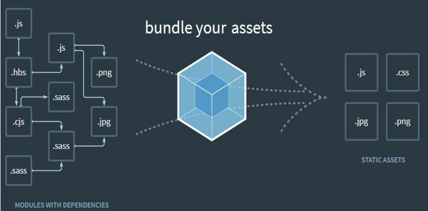

## 介绍

- webpack 是一种前端资源构建工具，一个静态模块打包器(module bundler)。 在 webpack 看来, 前端的所有资源文件(js/json/css/img/less/...)都会作为模块处理。 它将根据模块的依赖关系进行静态分析，打包生成对应的静态资源(bundle)。



## webpack 五个核心概念

### Entry

入口(Entry)指示 webpack 以哪个文件为入口起点开始打包，分析构建内部依赖图。

### Output

输出(Output)指示 webpack 打包后的资源 bundles 输出到哪里去，以及如何命名。

### Loader

将不同类型的文件转换为 webpack 可识别的模块。Loader 让 webpack 能够去处理那些非 JavaScript（Json） 文件。

### Plugins

插件(Plugins)可以用于执行范围更广的任务。插件的范围包括，从打包优化和压缩， 一直到重新定义环境中的变量等。

### Mode

模式(Mode)指示 webpack 使用相应模式的配置(默认值设置为 production)。

- development（能让代码本地调试运行的环境）：会将 DefinePlugin 中 process.env.NODE_ENV 的值设置 为 development。启用 NamedChunksPlugin 和 NamedModulesPlugin。
- production（能让代码优化上线运行的环境）：会将 DefinePlugin 中 process.env.NODE_ENV 的值设置 为 production。启用 FlagDependencyUsagePlugin, FlagIncludedChunksPlugin, ModuleConcatenationPlugin, NoEmitOnErrorsPlugin, OccurrenceOrderPlugin, SideEffectsFlagPlugin 和 TerserPlugin。

## 运行指令

- 开发环境：webpack ./src/index.js -o ./build/built.js --mode=development
      webpack会以 ./src/index.js 为入口文件开始打包，打包后输出到 ./build/built.js
      整体打包环境，是开发环境
- 生产环境：webpack ./src/index.js -o ./build/built.js --mode=production
      webpack会以 ./src/index.js 为入口文件开始打包，打包后输出到 ./build/built.js
      整体打包环境，是生产环境

### 执行流程

webpack 启动后会在 entry 里配置的 module 开始递归解析 entry 所依赖的所有 module，每找到一个 module, 就会根据配置的 loader 去找相应的转换规则，对 module 进行转换后在解析当前 module 所依赖的 module，这些模块会以 entry 为分组，一个 entry 和所有相依赖的 module 也就是一个 chunk，最后 webpack会把所有 chunk 转换成文件输出，在整个流程中 webpack 会在恰当的时机执行plugin的逻辑。

## 使用

### webpack.config.js - webpack的配置文件

- 作用: 指示 webpack 干哪些活（当运行 webpack 指令时，会加载里面的配置）
- 基于 nodejs 平台运行的，模块化默认采用 commonjs。

### 开发环境配置

```js
/*
  loader: 1. 下载   2. 使用（配置loader）
  plugins: 1. 下载  2. 引入  3. 使用
*/
// resolve用来拼接绝对路径的方法,nodejs模块:path
const { resolve } = require('path');
const HtmlWebpackPlugin = require('html-webpack-plugin');

module.exports = {
  // webpack配置
  // 入口起点
  entry: './src/index.js',
  // 输出
  output: {
    // 输出文件名
    filename: 'built.js',
    // 输出路径
    path: resolve(__dirname, 'build')
  },
  // loader的配置
  module: {
    rules: [
      {
        test: /\.css$/,
        use: [
          // use 数组中 loader 执行顺序：从右到左，从下到上 依次执行
          // 创建 style 标签，将 js 中的样式资源插入，添加到 head 中生效
          'style-loader',
          // 将 css 文件变成 commonjs 模块加载 js 中，里面内容是样式字符串
          'css-loader'
        ]
      },
      {
        test: /\.less$/,
        use: [
          'style-loader',
          'css-loader',
          // 将 less 文件编译成 css 文件
          'less-loader'
        ]
      },
      {
        test: /\.(jpg|png|gif)$/,
        //  url-loader file-loader(url-loader 在 file-loader 的基础上可以将图片转化为 base64 编码)
        loader: 'url-loader',
        options: {
          // 图片大小小于8kb，进行 base64 编码处理
          // 优点: 减少请求数量（减轻服务器压力）
          // 缺点：图片体积会更大（文件请求速度更慢）
          limit: 8 * 1024,
          // 问题：因为 url-loader 默认使用 es6 模块化解析，而 html-loader 引入图片是 commonjs
          // 解析时会出问题：[object Module]
          // 解决：关闭 url-loader 的 es6 模块化，使用 commonjs 解析
          esModule: false,
          // 给图片进行重命名
          // [hash:10] 取图片的 hash 的前10位
          // [ext] 取文件原来扩展名
          name: '[hash:10].[ext]',
          outputPath: 'images'
        }
      },
      {
        test: /\.html$/,
        // 处理 html 文件的 img 图片（负责引入 img，从而能被 url-loader 进行处理）
        loader: 'html-loader'
      },
      // 打包其他资源
      {
        exclude: /\.(html|js|css|less|jpg|png|gif)/,
        loader: 'file-loader',
        options: {
          name: '[hash:10].[ext]',
          outputPath: 'media'
        }
      }
    ]
  },
  plugins: [
    // 功能：默认会创建一个空的HTML，自动引入打包输出的所有资源（JS/CSS）
    new HtmlWebpackPlugin({
      // 复制 './src/index.html' 文件，并自动引入打包输出的所有资源（JS/CSS）
      template: './src/index.html'
    })
  ],
  // 模式
  mode: 'development', // 开发模式, mode: 'production' //生产模式

  // devServer：自动编译，自动打开浏览器，自动刷新浏览器
  // 特点：只会在内存中编译打包，不会有任何输出
  // 启动 devServer 指令为：npx webpack-dev-server
  devServer: {
    // 运行项目的目录
    contentBase: resolve(__dirname, 'build'),
    // 启动 gzip 压缩
    compress: true,
    // 端口号
    port: 3000,
    // 自动打开浏览器
    open: true
  }
}
```

### 生产环境配置

- 开发环境问题：
    - css 穿插在 js 中，导致 js 体积过大
    - 由于是先加载 js 再创建 style 标签添加到 html 中，会出现闪屏现象
    - 未压缩
    - 兼容性问题

```js
const { resolve } = require('path');
const MiniCssExtractPlugin = require('mini-css-extract-plugin');
const OptimizeCssAssetsWebpackPlugin = require('optimize-css-assets-webpack-plugin');
const HtmlWebpackPlugin = require('html-webpack-plugin');

// 定义 nodejs 环境变量：决定使用 browserslist 的哪个环境
process.env.NODE_ENV = 'production';

// 复用 loader
const commonCssLoader = [
  // 提取 js 中的 css 成单独文件(取代 style-loader)
  MiniCssExtractPlugin.loader,
  'css-loader',
  {
    // css兼容性处理：postcss --> postcss-loader postcss-preset-env(插件)
    // 帮 postcss 找到 package.json 中 browserslist 里面的配置，通过配置加载指定的 css 兼容性样式
    loader: 'postcss-loader',
    options: {
      ident: 'postcss',
      // postcss 的插件
      plugins: () => [require('postcss-preset-env')()]
    }
  }
];

module.exports = {
  entry: './src/js/index.js',
  output: {
    filename: 'js/built.js',
    path: resolve(__dirname, 'build')
  },
  module: {
    rules: [
      {
        test: /\.css$/,
        use: [...commonCssLoader]
      },
      {
        test: /\.less$/,
        use: [...commonCssLoader, 'less-loader']
      },
      /*
        当一个文件要被多个loader处理，那么一定要指定loader执行的先后顺序：先执行eslint 再执行babel
      */
      {
      /* 语法检查： eslint-loader  eslint
          设置检查规则：
            package.json中eslintConfig中设置
              "eslintConfig": {
                "extends": "airbnb-base"
              }*/
        test: /\.js$/,
        exclude: /node_modules/,
        // 优先执行
        enforce: 'pre',
        loader: 'eslint-loader',
        options: {
          fix: true
        }
      },
      {
       /*
        js兼容性处理：babel-loader @babel/core
          1. 基本js兼容性处理 --> @babel/preset-env
            问题：只能转换基本语法，如promise高级语法不能转换
          2. 全部js兼容性处理 --> @babel/polyfill
            问题：解决部分兼容性问题，但是会将所有兼容性代码全部引入，体积太大（在 js 文件中：import '@babel/polyfill';）
          3. 按需加载  --> core-js
      */
        test: /\.js$/,
        exclude: /node_modules/,
        loader: 'babel-loader',
        options: {
          // 预设：指示babel做怎么样的兼容性处理
          presets: [
            [
              '@babel/preset-env',
              {
                // 按需加载
                useBuiltIns: 'usage',
                // 指定core-js版本
                corejs: {version: 3},
                // 指定兼容性做到哪个版本浏览器
                targets: {
                  chrome: '60',
                  firefox: '60',
                  ie: '9',
                  safari: '10',
                  edge: '17'
                }
              }
            ]
          ]
        }
      },
      {
        test: /\.(jpg|png|gif)/,
        loader: 'url-loader',
        options: {
          limit: 8 * 1024,
          name: '[hash:10].[ext]',
          outputPath: 'imgs',
          esModule: false
        }
      },
      {
        test: /\.html$/,
        loader: 'html-loader'
      },
      {
        exclude: /\.(js|css|less|html|jpg|png|gif)/,
        loader: 'file-loader',
        options: {
          outputPath: 'media'
        }
      }
    ]
  },
  plugins: [
    new MiniCssExtractPlugin({
      // 对输出的css文件进行重命名
      filename: 'css/built.css'
    }),
    // 压缩css
    new OptimizeCssAssetsWebpackPlugin(),
    new HtmlWebpackPlugin({
      template: './src/index.html',
      // 压缩html代码
      minify: {
        // 移除空格
        collapseWhitespace: true,
        // 移除注释
        removeComments: true
      }
    })
  ],
  // 生产环境下会自动压缩 js 代码
  mode: 'production'
};
```

## webpack性能优化

### 开发环境性能优化

- 优化打包构建速度 - HMR(hot module replacement 热模块替换 / 模块热替换)

  作用：一个模块发生变化，只会重新打包这一个模块（而不是打包所有模块）极大提升构建速度
    - 样式文件：可以使用HMR功能：因为style-loader内部实现了~
    - js文件：默认不能使用HMR功能 --> 需要修改js代码，添加支持HMR功能的代码,注意：HMR功能对js的处理，只能处理非入口js文件的其他文件。
    - html文件: 默认不能使用HMR功能.同时会导致问题：html文件不能热更新了~ （不用做HMR功能）,解决：修改entry入口，将html文件引入

    ```js
    if (module.hot) {
      // 一旦 module.hot 为true，说明开启了HMR功能。 --> 让HMR功能代码生效
      module.hot.accept('./print.js', function() {
        // 方法会监听 print.js 文件的变化，一旦发生变化，其他模块不会重新打包构建。
        // 会执行后面的回调函数
        print();
      });
    }
    module.exports = {
      entry: ['./src/js/index.js', './src/index.html'],
      devServer: {
        contentBase: resolve(__dirname, 'build'),
        compress: true,
        port: 3000,
        open: true,
        // 开启HMR功能
        // 当修改了webpack配置，新配置要想生效，必须重新webpack服务
        hot: true
      }
    };
    ```

- 优化代码调试 - source-map (一种 提供源代码到构建后代码映射 技术 （如果构建后代码出错了，通过映射可以追踪源代码错误）)

    `devtool: 'eval-source-map'`
    > [inline-|hidden-|eval-][nosources-][cheap-[module-]]source-map

    - source-map：外部,
      错误代码准确信息 和 源代码的错误位置
    - inline-source-map：内联,
      只生成一个内联source-map
      错误代码准确信息 和 源代码的错误位置
    - hidden-source-map：外部,
      错误代码错误原因，但是没有错误位置
      不能追踪源代码错误，只能提示到构建后代码的错误位置
    - eval-source-map：内联,
      每一个文件都生成对应的source-map，都在eval
      错误代码准确信息 和 源代码的错误位置
    - nosources-source-map：外部,
      错误代码准确信息, 但是没有任何源代码信息
    - cheap-source-map：外部,
      错误代码准确信息 和 源代码的错误位置
      只能精确的行
    - cheap-module-source-map：外部,
      错误代码准确信息 和 源代码的错误位置
      module会将loader的source map加入

    > 内联 和 外部的区别：1. 外部生成了文件，内联没有 2. 内联构建速度更快

    - 开发环境：速度快，调试更友好 ( eval-source-map  / eval-cheap-module-souce-map)
        - 速度快(eval>inline>cheap>...)
            - eval-cheap-souce-map > eval-source-map
        - 调试更友好
            - souce-map
            - cheap-module-souce-map
            - cheap-souce-map
    - 生产环境：源代码要不要隐藏? 调试要不要更友好(source-map / cheap-module-souce-map)
        - 内联会让代码体积变大，所以在生产环境不用内联
        - nosources-source-map 全部隐藏
        - hidden-source-map 只隐藏源代码，会提示构建后代码错误信息

### 生产环境性能优化

- 优化打包构建速度
    - oneOf

    ```js
    rules: [
      {
        test: /\.js$/,
        exclude: /node_modules/,
        loader: 'eslint-loader',
      },
      {
        // 以下 loader 只会匹配一个
        // 注意：不能有两个配置处理同一种类型文件
        oneOf: [
          {
            test: /\.css$/,
            use: [...commonCssLoader]
          },
          {
            test: /\.js$/,
            exclude: /node_modules/,
            loader: 'babel-loader',
          },
        ]
      }
    ]
    ```

    - 缓存
        - babel缓存-让第二次打包构建速度更快

        ```js
        {
          test: /\.js$/,
          exclude: /node_modules/,
          loader: 'babel-loader',
          options: {
            presets: [
              [
                '@babel/preset-env',
                {
                  useBuiltIns: 'usage',
                  corejs: { version: 3 },
                  targets: {
                    chrome: '60',
                    firefox: '50'
                  }
                }
              ]
            ],
            // 开启babel缓存
            // 第二次构建时，会读取之前的缓存
            cacheDirectory: true
          }
        }
      ```

        - 文件资源缓存
        hash: 每次wepack构建时会生成一个唯一的hash值。
          问题: 因为js和css同时使用一个hash值。
            如果重新打包，会导致所有缓存失效。（可能我却只改动一个文件）
            - chunkhash：根据chunk生成的hash值。如果打包来源于同一个chunk，那么hash值就一样
          问题: js和css的hash值还是一样的
            因为css是在js中被引入的，所以同属于一个chunk
            - contenthash: 根据文件的内容生成hash值。不同文件hash值一定不一样
        --> 让代码上线运行缓存更好使用
    - 多进程打包
    - externals
    - dll
- 优化代码运行的性能
    - 缓存(hash-chunkhash-contenthash)
    - tree shaking
    - code split
    - 懒加载/预加载
    - pwa

[详细参见](https://github.com/dyj7/webpack)
