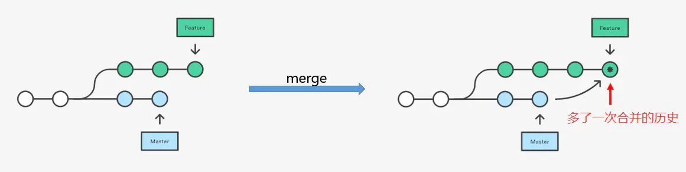
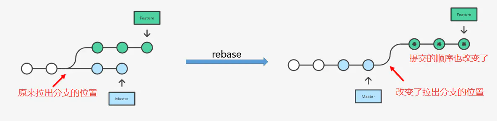

```bash
git clone url 克隆项目
git branch branch-name 新建分支
git branch 列出所有本地分支
git branch -r 列出所有远程分支
git branch -a 列出所有本地分支和远程分支
git checkout -b [branch] 新建一个分支，并切换到该分支
git status 查看状态
git diff 不加参数即默认比较工作区与暂存区
git diff --cached 比较暂存区与最新本地版本库
git add 添加文件到暂存区
git commit -m [message]  提交暂存区到仓库区 （-a 执行add后commit）
git commit --amend -m [message]   使用一次新的commit，替代上一次提交 (如果代码没有任何新变化，则用来改写上一次commit的提交信息)
git log 显示当前分支的版本历史
git log --stat 显示commit历史，以及每次commit发生变更的文件
git push origin branchName 推送到远程仓库
git push -f 强制push
git fetch origin 拉取远程分支
git merge origin 合并分支到当前分支
git pull origin master:brantest （git pull <远程主机名> <远程分支名>:<本地分支名>） 拉取远程分支并合并
git stash(暂存未提交变更-暂存区和工作区)
git stash pop 恢复最新的进度到工作区
撤销操作：
git checkout fileName   git checkout .   撤销工作区(未add)修改
git reset HEAD filePath 撤销暂存区(已add)修改
git revert commit_id  撤销 commit

 git merge master feature 将master分支合并到feature分支，会产生一条新的commit
 git rebase master 变基
 删除远程分支： git pull -p; git push origin :branchName
 删除本地分支： git branch -D branchName
 查看本地记录： git reflog
```

## git 合并commit:

```bash
1,查看提交历史，git log
commit 3ca6ec340edc66df13423f36f52919dfa3......
commit 1b4056686d1b494a5c86757f9eaed844......
commit 53f244ac8730d33b353bee3b24210b07......
commit 3a4226b4a0b6fa68783b07f1cee7b688.......
历史记录是按照时间排序的，时间近的排在前面。

2,git rebase
想要合并1-3条，有两个方法:
    1.从HEAD版本开始往过去数3个版本
    git rebase -i HEAD~3
    2.指名要合并的版本之前的版本号
    git rebase -i 3a4226b
请注意3a4226b这个版本是不参与合并的，可以把它当做一个坐标

3,选取要合并的提交
    1.执行了rebase命令之后，会弹出一个窗口，头几行如下：
    pick 3ca6ec3   '注释**********'
    pick 1b40566   '注释*********'
    pick 53f244a   '注释**********'
    2.将pick改为squash或者s,之后保存并关闭文本编辑窗口即可。改完之后文本内容如下：
    pick 3ca6ec3   '注释**********'
    s 1b40566   '注释*********'
    s 53f244a   '注释**********'

3.然后保存退出，Git会压缩提交历史，如果有冲突，需要修改，修改的时候要注意，保留最新的历史，不然我们的修改就丢弃了。修改以后要记得敲下面的命令：
git add .
git rebase --continue
如果你想放弃这次压缩的话，执行以下命令：
git rebase --abort

4.如果没有冲突，或者冲突已经解决，则会出现如下的编辑窗口：
# This is a combination of 4 commits.
#The first commit’s message is:
注释......
# The 2nd commit’s message is:
注释......
# The 3rd commit’s message is:
注释......
# Please enter the commit message for your changes. Lines starting # with ‘#’ will be ignored, and an empty message aborts the commit.
5.输入wq保存并推出, 再次输入git log查看 commit 历史信息，你会发现这两个 commit 已经合并了。
```

- merge



- rebase


