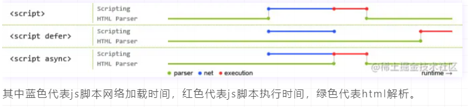

## src 和 href 的区别

- src 和 href 都是引用外部资源
- src： 表示对资源的引用，暂停其他资源的下载和处理，直到将该资源加载、编译、执⾏完毕。img script
- href： 表示超文本引用，它指向一些网络资源，并⾏下载资源，不会停⽌对当前⽂档的处理。 a  link

## 对 HTML 语义化的理解

- 根据不同的内容结构选择不同的标签
- 增加代码可读性，利于开发和维护
- 利于 seo, 爬虫更能搜到有效信息

```html
<header></header>  头部
<nav></nav>  导航栏
<section></section>  区块（有语义化的div）
<main></main>  主要区域
<article></article>  主要内容
<aside></aside>  侧边栏
<footer></footer>  底部
```

## DOCTYPE(⽂档类型) 的作⽤

- 告诉浏览器（解析器）应该以什么样（html或xhtml）的文档类型定义来解析文档，不同的渲染模式会影响浏览器对 CSS 代码甚⾄ JavaScript 脚本的解析。必须声明在HTML⽂档的第⼀⾏。

## script 标签中 defer 和 async 的区别

- 如果没有defer或async属性，浏览器会立即加载并执行相应的脚本。它不会等待后续加载的文档元素，读取到就会开始加载和执行，这样就阻塞了后续文档的加载。



- defer 和 async属性都是去异步加载外部的JS脚本文件，它们都不会阻塞页面的解析

- 执行顺序： 多个带async属性的标签，不能保证加载的顺序；多个带defer属性的标签，按照加载顺序执行
- 脚本是否并行执行：async属性，表示后续文档的加载和执行与js脚本的加载和执行是并行进行的，即异步执行；defer属性，加载后续文档的过程和js脚本的加载(此时仅加载不执行)是并行进行的(异步)，js脚本需要等到文档所有元素解析完成之后才执行，DOMContentLoaded事件触发执行之前。

## 常⽤的meta标签有哪些

```html
<meta charset="UTF-8" >  描述HTML文档的编码类型
<meta name="keywords" content="关键词" />
<meta name="description" content="页面描述内容" />
<!-- 适配移动端，可以控制视口的大小和比例: -->
<meta name="viewport" content="width=device-width, initial-scale=1, maximum-scale=1">
```

## HTML5有哪些更新

- 新增语义化标签：nav、header、footer、aside、section、article
- 音视频标签`<audio src='' controls autoplay loop='true'></audio><video src='' poster='imgs/aa.jpg' controls></video>`
- 表单类型: email url number color time data week month
- 数据存储：localStorage、sessionStorage

## head 标签中必不少的是

- `<base>, <link>, <meta>, <script>, <style>, <title>`
- `<title>` 定义文档的标题，是 head 部分中唯一必需的元素。

## `` 的 title 和 alt 有什么区别

- title 通常当鼠标滑动到元素上的时候显示
- alt 是 `` 的特有属性，是图片内容的等价描述，用于图片无法加载时显示、读屏器阅读图片。可提图片高可访问性，除了纯装饰图片外都必须设置有意义的值，搜索引擎会重点分析。

## cookies，sessionStorage 和 localStorage 的区别

- 存储大小：
    - cookie 数据大小不能超过4 k 。
    - sessionStorage 和 localStorage 虽然也有存储大小的限制，但比 cookie 大得多，可以达到 5M 或更大。
- 有期时间：
    - localStorage    存储持久数据，浏览器关闭后数据不丢失除非主动删除数据。
    - sessionStorage  数据在页面会话结束时会被清除。页面会话在浏览器打开期间一直保持，并且重新加载或恢复页面仍会保持原来的页面会话。在新标签或窗口打开一个页面时会在顶级浏览上下文中初始化一个新的会话。
   	- cookie          设置的 cookie 过期时间之前一直有效，即使窗口或浏览器关闭。
    - 作用域：
        - sessionStorage  只在同源的同窗口（或标签页）中共享数据，也就是只在当前会话中共享。
        - localStorage    在所有同源窗口中都是共享的。
        - cookie          在所有同源窗口中都是共享的。
