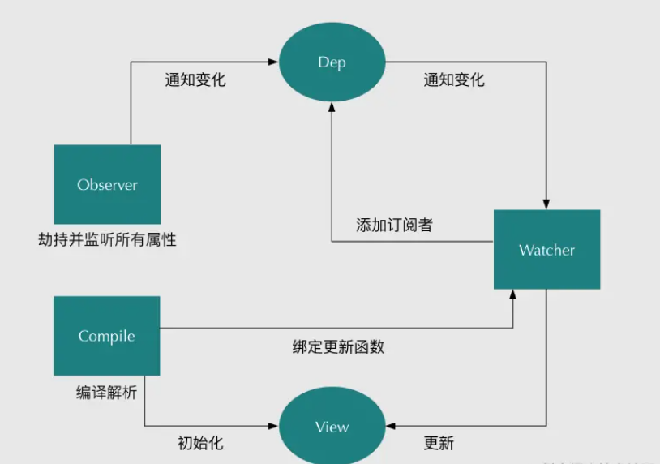

## 向数据绑定的原理

- Vue.js 是采用数据劫持结合发布者-订阅者模式的方式，通过Object.defineProperty()来劫持各个属性的setter，getter，在数据变动时发布消息给订阅者，触发相应的监听回调。
- 需要observe的数据对象进行递归遍历，包括子属性对象的属性，都加上setter和getter这样的话，给这个对象的某个值赋值，就会触发setter，那么就能监听到了数据变化
- compile解析模板指令，将模板中的变量替换成数据，然后初始化渲染页面视图，并将每个指令对应的节点绑定更新函数，添加监听数据的订阅者，一旦数据有变动，收到通知，更新视图
- Watcher订阅者是Observer和Compile之间通信的桥梁，主要做的事情是: ①在自身实例化时往属性订阅器(dep)里面添加自己 ②自身必须有一个update()方法 ③待属性变动dep.notice()通知时，能调用自身的update()方法，并触发Compile中绑定的回调，则功成身退。
- MVVM作为数据绑定的入口，整合Observer、Compile和Watcher三者，通过Observer来监听自己的model数据变化，通过Compile来解析编译模板指令，最终利用Watcher搭起Observer和Compile之间的通信桥梁，达到数据变化 -> 视图更新；视图交互变化(input) -> 数据model变更的双向绑定效果。


## Observer,Watcher,Compile

```js
// Observer

function defineReactive(data, key, val) {
    observe(val); // 递归遍历所有子属性
    var dep = new Dep();
    Object.defineProperty(data, key, {
        enumerable: true,
        configurable: true,
        get: function() {
            // 监听器Observer是在get函数执行了添加订阅者Wather的操作
            if (Dep.target) {.  // 判断是否需要添加订阅者
                dep.addSub(Dep.target); // 在这里添加一个订阅者
            }
            return val;
        },
        set: function(newVal) {
            if (val === newVal) {
                return;
            }
            val = newVal;
            console.log('属性' + key + '已经被监听了，现在值为：“' + newVal.toString() + '”');
            dep.notify(); // 如果数据变化，通知所有订阅者
        }
    });
}
Dep.target = null;
// 容纳订阅者的消息订阅器Dep，订阅器Dep主要负责收集订阅者，然后再属性变化的时候执行对应订阅者的更新函数。
function Dep () {
    this.subs = [];
}
Dep.prototype = {
    addSub: function(sub) {
        this.subs.push(sub);
    },
    notify: function() {
        this.subs.forEach(function(sub) {
            sub.update();
        });
    }
};
// Watcher
function Watcher(vm, exp, cb) {
    this.cb = cb;
    this.vm = vm;
    this.exp = exp;
    this.value = this.get();  // 将自己添加到订阅器的操作
}

Watcher.prototype = {
    update: function() {
        this.run();
    },
    run: function() {
        var value = this.vm.data[this.exp];
        var oldVal = this.value;
        if (value !== oldVal) {
            this.value = value;
            this.cb.call(this.vm, value, oldVal);
        }
    },
    get: function() {
        // 只要在订阅者Watcher初始化的时候才需要添加订阅者，在Dep.target上缓存下订阅者
        Dep.target = this;  // 缓存自己
        var value = this.vm.data[this.exp]  // 强制执行监听器里的get函数
        Dep.target = null;  // 释放自己
        return value;
    }
};
// Compile 1.解析模板指令，并替换模板数据，初始化视图2.将模板指令对应的节点绑定对应的更新函数，初始化相应的订阅器
```

## Computed 和 Watch 的区别

- Computed：
    - 支持缓存，只有依赖的数据发生了变化，才会重新计算
    - 不支持异步，当Computed中有异步操作时，无法监听数据的变化
    - computed的值会默认走缓存，计算属性是基于它们的响应式依赖进行缓存的，也就是基于data声明过，或者父组件传递过来的props中的数据进行计算的。
    - 如果一个属性是由其他属性计算而来的，这个属性依赖其他的属性，一般会使用computed
    - 如果computed属性的属性值是函数，那么默认使用get方法，函数的返回值就是属性的属性值；在computed中，属性有一个get方法和一个set方法，当数据发生变化时，会调用set方法。

    ```js
    computed: {
        // 计算属性的 getter
        reversedMessage () {
            // `this` 指向 vm 实例
            return this.message.split('').reverse().join('')
        }
        reversedMessage2 () {
            get(){
                return this.message.split('').reverse().join('')
            },
            set(){

            }
        }
    }
    ```

- Watch：
    - 不支持缓存，数据变化时，就会触发相应的操作
    - 支持异步监听
    - 监听的函数接收两个参数，第一个参数是最新的值，第二个是变化之前的值
    - 当一个属性发生变化时，就需要执行相应的操作
    - 监听数据必须是data中声明的或者父组件传递过来的props中的数据，当发生变化时，会触发其他操作，函数有两个的参数：
        - immediate：组件加载立即触发回调函数
        - deep：深度监听，发现数据内部的变化，在复杂数据类型中使用，例如数组中的对象发生变化。需要注意的是，deep无法监听到数组和对象内部的变化。
    - 当想要执行异步或者昂贵的操作以响应不断的变化时，就需要使用watch。

    ```js
    watch: {
        obj: {
            handler(newVal, oldVal) {
                // ...
            },
            deep: true,
            immediate: true,
        },
    }
    ```

- computed 计算属性 : 依赖其它属性值，并且 computed 的值有缓存，只有它依赖的属性值发生改变，下一次获取 computed 的值时才会重新计算 computed 的值。
- watch 侦听器 : 更多的是观察的作用，无缓存性，类似于某些数据的监听回调，每当监听的数据变化时都会执行回调进行后续操作。
- 运用场景：
    - 需要进行数值计算,并且依赖于其它数据时，应该使用 computed，因为可以利用 computed 的缓存特性，避免每次获取值时都要重新计算。
    - 需要在数据变化时执行异步或开销较大的操作时，应该使用 watch，使用 watch 选项允许执行异步操作 ( 访问一个 API )，限制执行该操作的频率，并在得到最终结果前，设置中间状态。这些都是计算属性无法做到的。

## 常见的事件修饰符及其作用

- .stop：等同于 JavaScript 中的 event.stopPropagation() ，防止事件冒泡；
- .prevent ：等同于 JavaScript 中的 event.preventDefault() ，防止执行预设的行为（如果事件可取消，则取消该事件，而不停止事件的进一步传播）；
- .capture ：与事件冒泡的方向相反，事件捕获由外到内；
- .self ：只会触发自己范围内的事件，不包含子元素；
- .once ：只会触发一次。

## v-if和v-show的区别

- 手段：v-if是动态的向DOM树内添加或者删除DOM元素；v-show是通过设置DOM元素的display样式属性控制显隐；
- 编译过程：v-if切换有一个局部编译/卸载的过程，切换过程中合适地销毁和重建内部的事件监听和子组件；v-show只是简单的基于css切换；
- 编译条件：v-if是惰性的，如果初始条件为假，则什么也不做；只有在条件第一次变为真时才开始局部编译; v-show是在任何条件下，无论首次条件是否为真，都被编译，然后被缓存，而且DOM元素保留；
- 性能消耗：v-if有更高的切换消耗；v-show有更高的初始渲染消耗；
- 使用场景：v-if适合运营条件不大可能改变；v-show适合频繁切换。

## 父子组件间 v-model

```js
// 在父组件中用v-model相当于，v-bind绑定了value，以及执行了v-on:input事件
<child v-model="msg"></child>  //相当于<child v-bind:value="flag" v-on:input="flag=$event"></flag>

// 用props接收父组件传递的value值，从而实现双向数据绑定
  props: {
    value: {
      type: Boolean,
      default: true
    }
  },
  methods: {
    // 通过$emit触发父组件的input事件，并将第二个参数作为值传递给父组件
    confirm () {
      this.$emit('input', '123')
    }
  }
    // 自定义prop(重命名value)和event
    model: {
        prop: "name",
        event: "getName",
    },
    props: ["name"],
    template: `
        <input
            :value="name"
            @input="$emit('getName', $event.target.value)"
        >
        `,
```

- .sync 绑定多个值 `<comp :foo="bar" @update:foo="val => bar = val"></comp>` 等价于 `<comp :foo.sync="bar"></comp>`

```js
// 父
<child-com v-bind.sync="obj" />
// 子
Vue.component("child-com", {
props: ["value", "name", "age"],
methods: {
    inputValueEvent(event) {
        this.$emit("update:value", event.target.value);
    },
    inputNameEvent(event) {
        this.$emit("update:name", event.target.value);
    },
    inputAgeEvent(event) {
        this.$emit("update:age", event.target.value);
    },
},
template: `
    <div>
        <input type="text" :value="value" @input='inputValueEvent'>
        <input type="text" :value="name" @input='inputNameEvent'>
        <input type="text" :value="age" @input='inputAgeEvent'>
    </div>
`,
});
```

## data为什么是一个函数而不是对象

- JavaScript中的对象是引用类型的数据，当多个实例引用同一个对象时，只要一个实例对这个对象进行操作，其他实例中的数据也会发生变化。
- 而在Vue中，更多的是想要复用组件，那就需要每个组件都有自己的数据，这样组件之间才不会相互干扰。
- 所以组件的数据不能写成对象的形式，而是要写成函数的形式。数据以函数返回值的形式定义，这样当每次复用组件的时候，就会返回一个新的data，也就是说每个组件都有自己的私有数据空间，它们各自维护自己的数据，不会干扰其他组件的正常运行。

## keep-alive

- keep-alive 是 Vue 内置的一个组件，可以使被包含的组件保留状态，或避免重新渲染，组件会被缓存。它自身不会渲染一个 DOM 元素，也不会出现在父组件链中。
    - include 包含的组件(可以为字符串，数组，以及正则表达式,只有匹配的组件会被缓存)
    - exclude 排除的组件(以为字符串，数组，以及正则表达式,任何匹配的组件都不会被缓存，exclude优先于include)
    - max 缓存组件的最大值(类型为字符或者数字,可以控制缓存组件的个数，如果缓存的组件超过了max设定的值，那么将删除第一个缓存的组件)
- 页面第一次进入，钩子的触发顺序 created-> mounted-> activated，退出时触发 deactivated 当再次进入（前进或者后退）时，只触发 activated
- 缓存 router-view 里面的某些组件

    ```js
    <keep-alive>
        <router-view v-if="$route.meta.keepAlive"></router-view>
    </keep-alive>
    <router-view v-if="!$route.meta.keepAlive"></router-view>
    //...router.js
    export default new Router({
        routes: [
            {
            path: '/',
            name: 'Hello',
            component: Hello,
            meta: {
                keepAlive: false // 不需要缓存
                }
            },
            {
            path: '/page1',
            name: 'Page1',
            component: Page1,
            meta: {
                keepAlive: true // 需要被缓存
                }
            }
        ]
    })
    ```

## $nextTick

- 在下次 DOM 更新循环结束之后执行延迟回调。在修改数据之后立即使用这个方法，获取更新后的 DOM。
- Vue是异步执行DOM更新的，一旦观察到数据变化，Vue就会开启一个队列，然后把在同一个事件循环(event loop)中观察到的数据变化的watcher推送进这个队列。如果这个watcher被触发多次，只会被推送到队列一次。这种缓冲行为可以有效去掉重复数据造成不必要的计算和DOM操作。而在下一个事件循环时，Vue会清空队列，并进行必要的DOM更新。

## vm.$set 的实现原理

- 如果目标是数组，直接使用数组的 splice 方法触发相应式；(splice、 push、pop、shift、unshift、sort、reverse
- 如果目标是对象，会先判读属性是否存在、对象是否是响应式，最终如果要对属性进行响应式处理，则是通过调用 defineReactive 方法进行响应式处理（ defineReactive 方法就是 Vue 在初始化对象时，给对象属性采用 Object.defineProperty 动态添加 getter 和 setter 的功能所调用的方法）

## v-if和v-for的优先级

- 在 v-for 的时候，建议设置key值，并且保证每个key值是独一无二的，这便于diff算法进行优化
- v-for优先级比v-if高
- 永远不要把 v-if 和 v-for 同时用在同一个元素上，带来性能方面的浪费（每次渲染都会先循环再进行条件判断）
- 如果避免出现这种情况，则在外层嵌套template（页面渲染不生成dom节点），在这一层进行v-if判断，然后在内部进行v-for循环
- 如果条件出现在循环内部，可通过计算属性computed提前过滤掉那些不需要显示的项

## 生命周期

- beforeCreate（创建前）：数据观测和初始化事件还未开始，此时 data 的响应式追踪、event/watcher 都还没有被设置，也就是说不能访问到data、computed、watch、methods上的方法和数据。
- created（创建后） ：实例创建完成，实例上配置的 options 包括 data、computed、watch、methods 等都配置完成，但是此时渲染得节点还未挂载到 DOM，所以不能访问到 $el 属性。
- beforeMount（挂载前）：在挂载开始之前被调用，相关的render函数首次被调用。实例已完成以下的配置：编译模板，把data里面的数据和模板生成html。此时还没有挂载html到页面上。
- mounted（挂载后）：在el被新创建的 vm.$el 替换，并挂载到实例上去之后调用。实例已完成以下的配置：用上面编译好的html内容替换el属性指向的DOM对象。完成模板中的html渲染到html 页面中。此过程中进行ajax交互。
- beforeUpdate（更新前）：响应式数据更新时调用，此时虽然响应式数据更新了，但是对应的真实 DOM 还没有被渲染。
- updated（更新后） ：在由于数据更改导致的虚拟DOM重新渲染和打补丁之后调用。此时 DOM 已经根据响应式数据的变化更新了。调用时，组件 DOM已经更新，所以可以执行依赖于DOM的操作。然而在大多数情况下，应该避免在此期间更改状态，因为这可能会导致更新无限循环。该钩子在服务器端渲染期间不被调用。
- beforeDestroy（销毁前）：实例销毁之前调用。这一步，实例仍然完全可用，this 仍能获取到实例。
- destroyed（销毁后）：实例销毁后调用，调用后，Vue 实例指示的所有东西都会解绑定，所有的事件监听器会被移除，所有的子实例也会被销毁。该钩子在服务端渲染期间不被调用。
- keep-alive 独有的生命周期: activated 和 deactivated 。用 keep-alive 包裹的组件在切换时不会进行销毁，而是缓存到内存中并执行 deactivated 钩子函数，命中缓存渲染后会执行 activated 钩子函数。

## 子组件和父组件执行顺序

- 父组件 beforeCreate、父组件 created、父组件 beforeMount、子组件 beforeCreate、子组件 created、子组件 beforeMount、子组件 mounted、父组件 mounted
- 父组件 beforeUpdate、子组件 beforeUpdate、子组件 updated、父组件 updated
- 父组件 beforeDestroy、子组件 beforeDestroy、子组件 destroyed、父组件 destoryed

## created和mounted的区别

- created:在模板渲染成html前调用，即通常初始化某些属性值，然后再渲染成视图。
- mounted:在模板渲染成html后调用，通常是初始化页面完成后，再对html的dom节点进行一些需要的操作。

## Vue-Router 的懒加载

```js
// 非懒加载：
import List from '@/components/list.vue'
const router = new VueRouter({
  routes: [
    { path: '/list', component: List }
  ]
})
// 箭头函数+import动态加载
const List = () => import('@/components/list.vue')
const router = new VueRouter({
  routes: [
    { path: '/list', component: List }
  ]
})
// 组件懒加载
components:{
    "One-com": ()=>import("./one");
},
```

## 路由的hash和history

- hash模式是开发中默认的模式，它的URL带着一个#，例如：www.abc.com/#/vue，它的hash值就是#/vue。hash值会出现在URL里面，但是不会出现在HTTP请求中，对后端完全没有影响。所以改变hash值，不会重新加载页面。hash值变化对应的URL都会被浏览器记录下来，这样浏览器就能实现页面的前进和后退。

```js
window.onhashchange = function(event){
	console.log(event.oldURL, event.newURL);
	let hash = location.hash.slice(1);
}
```

- history模式的URL中没有#，用户在输入一个URL时，服务器会接收这个请求，并解析这个URL，然后做出相应的逻辑处理。在刷新页面的时候，如果没有相应的路由或资源，就出现404。

```js
const router = new VueRouter({
  mode: 'history',// 切换为 history 模式
  routes: [...]
})
```

## 获取页面的hash变化

```js
// 监听 $route 的变化,当路由发生变化的时候执行
watch: {
  $route: {
    handler: function(val, oldVal){
      console.log(val);
    },
    // 深度观察监听
    deep: true
  }
},
```

- window.location.hash读取#值 window.location.hash 的值可读可写，读取来判断状态是否改变，写入时可以在不重载网页的前提下，添加一条历史访问记录。

## $route 和 $router 的区别

- $route “路由信息对象”
    - $route.path: 返回字符串，对应当前路由的路径，总是解析为绝对路径。
    - $route.params: 返回一个key-value对象，包含了动态片段和全匹配片段，如果没有路由参数，就是一个空对象。
    - $route.query: 返回一个key-value对象，表示URL查询参数。
    - $route.hash: 返回当前路由的带#的hash值，如果没有hash值，则为空字符串。
    - $route.meta: 返回当前的路由元信息。
    - $route.fullPath: 返回完成解析后的URL，包含查询参数和hash的完整路径。
    - $route.matched: 返回一个数组，包含当前路由的所有嵌套路径片段的路由记录，路由记录就是routes配置数组中的对象副本。
    - $route.name: 如果存在当前路由名称则返回当前路由的名称。
    - $route.redirectedFrom: 如果存在重定向，即为重定向来源的路由的名字。
- $router “路由实例”对象包括了路由的跳转方法，钩子函数等。
    - $router.beforeEach(to, from, next): 全局前置守卫，守卫是异步解析执行，此时导航在所有守卫resolve完之前一直处于等待中状态，守卫方法接收三个参数: to: Route即将要进入的目标路由对象、from: Route: 当前导航正要离开的路由、next: Function: 调用该方法来resolve这个钩子，执行效果依赖next方法的调用参数，例如next()、next(false)、next('/')、next({path:'/',name:'home',replace:true,query:{q:1}})、next(error)等，通常在main.js中import的Vue Router实例中直接定义导航守卫，当然也可在Vue实例中访问$router来定义。
    - $router.afterEach(to, from): 全局后置钩子，进入路由之后调用，接收to、from两个参数。
    - $router.push(location[, onComplete[, onAbort]]): 编程式导航，使用$router.push方法导航到不同的URL，此方法会向history栈添加一个新的记录，当点击浏览器后退按钮时，则回到之前的URL。
    - $router.replace(location[, onComplete[, onAbort]]): 编程式导航，跟$router.push很像，唯一的不同就是，其不会向history添加新记录，而是跟它的方法名一样替换掉当前的history记录。
    - $router.go(n): 编程式导航，这个方法的参数是一个整数，意思是在history记录中向前或者后退多少步，类似window.history.go(n)。
    - $router.back(): 编程式导航，后退一步记录，等同于$router.go(-1)。
    - $router.onError(callback): 注册一个回调，该回调会在路由导航过程中出错时被调用，被调用的错误必须是下列情形中的一种，错误在一个路由守卫函数中被同步抛出、错误在一个路由守卫函数中通过调用next(err)的方式异步捕获并处理、渲染一个路由的过程中需要尝试解析一个异步组件时发生错误。

## params 和 query 参数

- param方式(使用params方法，只能用name来引入路由，如果这里写成了path，接收参数页面会是undefined。如果路由上面不写参数，也是可以传过去的，但不会在url上面显示参数，跳到别的页面或者刷新页面的时候参数会丢失)

```js
// /user/123
// 定义：
{
   path: '/user/:id',
   name: 'users',
   component: User,
},
// 跳转方法1：
<router-link :to="{ name: 'users', params: { id: 123 }}">按钮</router-link
// 跳转方法2：
this.$router.push({name:'users',params:{ id:123 }})
// 跳转方法3：
this.$router.push('/user/' + 123)
// 接收参数:
this.$route.params.id
```

- query方式

```js
// /user?id=123
// 传参:
this.$router.push({
        path:'/user',// 或者：name: 'users'
        query:{
          id:123
        }
      })

// 接收参数:
this.$route.query.id
```
