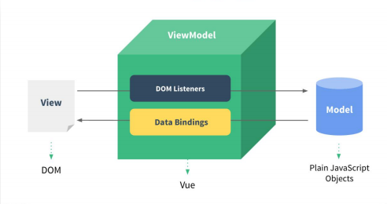
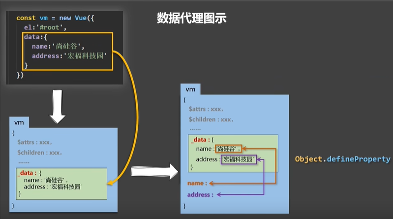
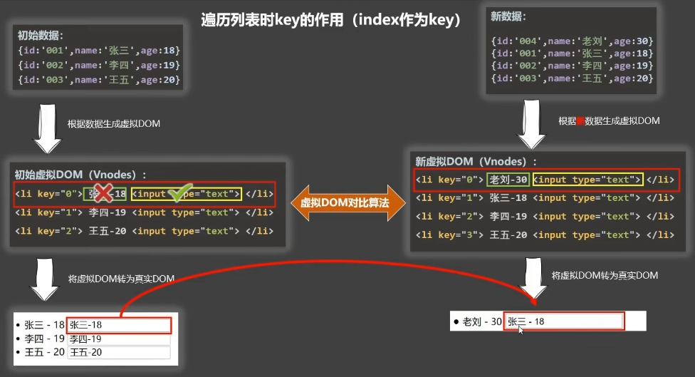
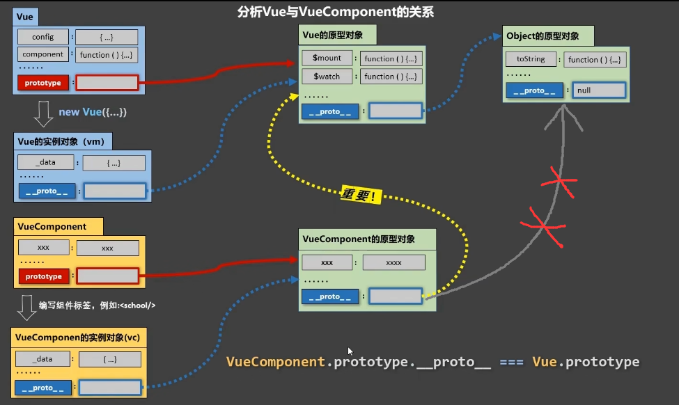

## 简介

- 动态构建用户界面的渐进式 JavaScript 框架
- 遵循 MVVM 模式
- 编码简洁, 体积小, 运行效率高, 适合移动/PC 端开发
- 它本身只关注 UI, 也可以引入其它第三方库开发项目

### 特点

- 采用组件化模式，提高代码复用率，利于代码维护
- 声明式编码，无需直接操作 DOM, 提高开发效率
- 虚拟 DOM + Diff 算法，尽量复用 DOM 节点

## Vue 核心

### 引入

```js
<div id='root'>
    {{ name }}
</div>
// 引入后全局会多一个名为 Vue 的构造函数
<script src="https://cdn.jsdelivr.net/npm/vue@2.6.14/dist/vue.js"></script>
<script>
    const vm = new Vue({
        // 指定当前 Vue 实例为哪个容器服务(容器和实例是一对一的关系)
        el: '#root',
        data: {
            name: 'aaa'
        }
    })
</script>
```

### 模板语法

#### 插值语法(标签体内容)

```html
<div id='root'>
     <!-- {{ js 表达式 }} -->
    {{ name }}
</div>
```

#### 指令语法(解析标签：标签属性，标签体内容，绑定事件)

```js
<div id='root'>
    <a v-bind:href="url" :title="title" />
</div>

<script>
    const vm = new Vue({
        el: '#root',
        data: {
            url: 'www.xxx'
        }
    })
</script>
```

### 数据绑定

```js
<div id='root'>
    // 单向绑定，数据又 data 流向页面
    <input v-bind:value="name"/>
    // 双向绑定，v-modal 只能用于表单类（输入类）元素上，v-modal:value == v-modal
    <input v-modal:value="name"/>
    <input v-modal="name"/>
</div>

<script>
    const vm = new Vue({
        el: '#root',
        data: {
            name: 'aaa'
        }
    })
</script>
```

### el 与 data  的两种写法

```js
const vm = new Vue({
    data(){
        // 此处 this 是 Vue 实例对象
        // 又 Vue 管理的函数不要写箭头函数，写了箭头函数， this 就不再指向 Vue 实例
        return {
            name: 'aaa'
        }
    }
})
vm.$mount('#root')
```

### MVVM 模型

- M：模型(Model) ：对应 data 中的数据
- V：视图(View) ：模板
- VM：视图模型(ViewModel) ： Vue 实例对象
- vm 身上所有的属性及 Vue 原型上所有属性，在 Vue 模板中都可以直接使用。



### 数据代理(通过一个对象代理对另一个对象中属性的操作（读/写）)

#### Object.defineProperty

```js
let number = 18
let person = {
    name:'张三',
    sex:'男',
}
Object.defineProperty(person,'age',{
    // value:18,
    // enumerable:true, //控制属性是否可以枚举，默认值是false
    // writable:true, //控制属性是否可以被修改，默认值是false
    // configurable:true //控制属性是否可以被删除，默认值是false
    //当有人读取person的age属性时，get函数(getter)就会被调用，且返回值就是age的值
    get(){
        console.log('有人读取age属性了')
        return number
    },
    //当有人修改person的age属性时，set函数(setter)就会被调用，且会收到修改的具体值
    set(value){
        console.log('有人修改了age属性，且值是',value)
        number = value
    }
})
// console.log(Object.keys(person))  输出可枚举的 key
console.log(person)
```

#### Vue 中的数据代理

- data 中所有的属性，最后都出现在 vm 身上
- 通过 vw 读取数据是读取 data 中的数据，通过 vm 修改数据是修改 data 中的数据。
    - 通过Object.defineProperty()把data对象中所有属性添加到vm上。
    - 为每一个添加到vm上的属性，都指定一个getter/setter。
    - 在getter/setter内部去操作（读/写）data中对应的属性。

```js
const data = {
    name: 'aaa'
}
const vm = new Vue({
    el:'#root',
    data
})
// vm._data === data -> true（1.加工data(数据劫持),2.vm._data=data）
```



### 事件处理

- 使用v-on:xxx 或 @xxx 绑定事件，其中xxx是事件名；
- 事件的回调需要配置在methods对象中，最终会在vm上；
- methods中配置的函数，不要用箭头函数！否则this就不是vm了；
- methods中配置的函数，都是被Vue所管理的函数，this的指向是vm 或 组件实例对象；
- @click="demo" 和 @click="demo($event)" 效果一致，但后者可以传参；
- 事件修饰符
    - prevent：阻止默认事件（常用）；
    - stop：阻止事件冒泡（常用）；
    - once：事件只触发一次（常用）；
    - capture：使用事件的捕获模式(一般是在冒泡阶段处理事件)；
    - self：只有event.target是当前操作的元素时才触发事件；
    - passive：事件的默认行为立即执行，无需等待事件回调执行完毕；
- 键盘事件 `<input type="text" placeholder="按下回车提示输入" @keydown.enter="showInfo">`

```html
<!-- <button v-on:click="showInfo">点我提示信息</button> -->
<button @click.stop="showInfo1">点我提示信息1（不传参）</button>
<button @click="showInfo2($event,66)">点我提示信息2（传参）</button>
<script type="text/javascript">
    const vm = new Vue({
        methods:{
            showInfo1(event){
                // console.log(event.target.innerText)
                // console.log(this) //此处的this是vm
            },
            showInfo2(event,number){
                console.log(event,number)
                // console.log(event.target.innerText)
                // console.log(this) //此处的this是vm
            }
        }
    })
</script>
```

### 计算属性

- 定义：要用的属性不存在，要通过已有属性计算得来。
- 原理：底层借助了Objcet.defineproperty方法提供的getter和setter。
- get函数什么时候执行？
    - 初次读取时会执行一次。
    - 当依赖的数据发生改变时会被再次调用。
- 优势：与methods实现相比，内部有缓存机制（复用），效率更高，调试方便。
- 备注：
    - 计算属性最终会出现在vm上，直接读取使用即可。
    - 如果计算属性要被修改，那必须写set函数去响应修改，且set中要引起计算时依赖的数据发生改变。

```js
<div id="root">
    姓：<input type="text" v-model="firstName"> <br/><br/>
    名：<input type="text" v-model="lastName"> <br/><br/>
    全名：<span>{{fullName}}</span> <br/><br/>
</div>
<script type="text/javascript">
    const vm = new Vue({
        el:'#root',
        data:{
            firstName:'张',
            lastName:'三',
        },
        computed:{
            //完整写法
            /* fullName:{
                get(){
                    console.log('get被调用了')
                    return this.firstName + '-' + this.lastName
                },
                set(value){
                    console.log('set',value)
                    const arr = value.split('-')
                    this.firstName = arr[0]
                    this.lastName = arr[1]
                }
            } */
            //简写
            fullName(){
                console.log('get被调用了')
                return this.firstName + '-' + this.lastName
            }
        }
    })
</script>
```

### 监视属性

- 当被监视的属性变化时, 回调函数自动调用, 进行相关操作
- 监视的属性必须存在，才能进行监视,计算属性也可以被监视（不存在的属性都是 undefined ）
- 监视的两种写法：
    - new Vue时传入watch配置
    - 通过vm.$watch监视
- Vue中的watch默认不监测对象内部值的改变(deep:true)

```js
watch:{
    isHot:{
        immediate:true, // 初始化时让handler调用一下
        // handler什么时候调用？当isHot发生改变时。
        handler(newValue,oldValue){
            console.log('isHot被修改了',newValue,oldValue)
        }
    },
    //监视多级结构中某个属性的变化
    /* 'numbers.a':{
     handler(){
      console.log('a被改变了')
     }
    } */
    //监视多级结构中所有属性的变化
    numbers:{
     deep:true,
     handler(){
      console.log('numbers改变了')
     }
    },
    //简写
    /* isHot(newValue,oldValue){
     console.log('isHot被修改了',newValue,oldValue,this)
    } */
}

vm.$watch('isHot',{
    immediate:true, //初始化时让handler调用一下
    //handler什么时候调用？当isHot发生改变时。
    handler(newValue,oldValue){
        console.log('isHot被修改了',newValue,oldValue)
    },
})
```

### 计算属性和监视属性的区别

- computed能完成的功能，watch都可以完成。
- watch能完成的功能，computed不一定能完成，例如：watch可以进行异步操作。
- 两个重要的小原则：
    - 所被Vue管理的函数，最好写成普通函数，这样this的指向才是vm 或 组件实例对象。
    - 所有不被Vue所管理的函数（定时器的回调函数、ajax的回调函数等、Promise的回调函数），最好写成箭头函数，
这样this的指向才是vm 或 组件实例对象。

```js
watch:{
firstName(val){
 setTimeout(()=>{
  console.log(this)
  this.fullName = val + '-' + this.lastName
 },1000);
},
}
```

#### 绑定样式

### 绑定样式

- class样式:写法:class="xxx" xxx可以是字符串、对象、数组。
    - 字符串写法适用于：类名不确定，要动态获取。
    - 对象写法适用于：要绑定多个样式，个数不确定，名字也不确定。
    - 数组写法适用于：要绑定多个样式，个数确定，名字也确定，但不确定用不用。
- style样式
    - :style="{fontSize: xxx}"其中xxx是动态值。
    - :style="[a,b]"其中a、b是样式对象。

```html
<div class="basic" :class="mood classArr classObj" @click="changeMood">{{name}}</div> <br/><br/>
<div class="basic" :style="styleObj styleArr">{{name}}</div> <br/><br/>
 data:{
  mood:'normal',
  classArr:['atguigu1','atguigu2'],
  classObj:{
   atguigu1:false,
   atguigu2:false,
  },
  styleObj:{
   fontSize: '40px',
   color:'red',
  },
  styleObj2:{
   backgroundColor:'orange'
  },
  styleArr:[
   {
    fontSize: '40px',
    color:'blue',
   },
   {
    backgroundColor:'gray'
   }
  ]
 },
```

### 条件渲染

- v-if：v-if="表达式" ,v-else-if="表达式",v-else="表达式"
    - 适用于：切换频率较低的场景。
    - 特点：不展示的DOM元素直接被移除。
    - 注意：v-if可以和:v-else-if、v-else一起使用，但要求结构不能被“打断”。
- v-show：v-show="表达式"
    - 适用于：切换频率较高的场景。
    - 特点：不展示的DOM元素未被移除，仅仅是使用样式隐藏掉
- 备注：使用v-if的时，元素可能无法获取到，而使用v-show一定可以获取到。
- v-if与template的配合使用 `<template v-if="n === 1"></template>`,v-show 不支持 `<template>` 元素，也不支持 v-else

### 列表渲染（v-for指令）

- 语法：v-for="(item, index) in xxx" :key="yyy"
- 可遍历：数组、对象、字符串（用的很少）、指定次数（用的很少）

#### key 的作用

- 虚拟DOM中key的作用：
    - key是虚拟DOM对象的标识，当数据发生变化时，Vue会根据【新数据】生成【新的虚拟DOM】,
    - 随后Vue进行【新虚拟DOM】与【旧虚拟DOM】的差异比较，比较规则如下：
- 对比规则：
    - 旧虚拟DOM中找到了与新虚拟DOM相同的key：
        - 若虚拟DOM中内容没变, 直接使用之前的真实DOM！
        - 若虚拟DOM中内容变了, 则生成新的真实DOM，随后替换掉页面中之前的真实DOM。
    - 旧虚拟DOM中未找到与新虚拟DOM相同的key：创建新的真实DOM，随后渲染到到页面。
- 用index作为key可能会引发的问题：
    - 若对数据进行：逆序添加、逆序删除等破坏顺序操作:会产生没有必要的真实DOM更新 ==> 界面效果没问题, 但效率低。
    - 如果结构中还包含输入类的DOM：会产生错误DOM更新 ==> 界面有问题。
- 开发中如何选择key?:
    - 最好使用每条数据的唯一标识作为key, 比如id、手机号、身份证号、学号等唯一值。
    - 如果不存在对数据的逆序添加、逆序删除等破坏顺序操作，仅用于渲染列表用于展示，使用index作为key是没有问题的。



#### 检测数据改变的原理

- Vue监视数据的原理：
    - vue会监视data中所有层次的数据。
    - 如何监测对象中的数据？ 通过setter实现监视，且要在new Vue时就传入要监测的数据。
        - 对象中后追加的属性，Vue默认不做响应式处理
        - 如需给后添加的属性做响应式，请使用如下API：`Vue.set(target，propertyName/index，value)` 或 `vm.$set(target，propertyName/index，value)`
    - 如何监测数组中的数据？通过包裹数组更新元素的方法实现，本质就是做了两件事：
        - 调用原生对应的方法对数组进行更新。
        - 重新解析模板，进而更新页面。
    - 在Vue修改数组中的某个元素一定要用如下方法(直接通过下标修改数组 Vue 检测不到)：
        - 使用这些API:push()、pop()、shift()、unshift()、splice()、sort()、reverse()
        - Vue.set() 或 vm.$set()
    - 特别注意：Vue.set() 和 vm.$set() 不能给vm 或 vm的根数据对象 添加属性

- 模拟数据检测

```js
 let data = {
  name:'aaa',
  age:18,
 }
 //创建一个监视的实例对象，用于监视data中属性的变化
 const obs = new Observer(data)
 console.log(obs)
 //准备一个vm实例对象
 let vm = {}
 vm._data = data = obs //
 function Observer(obj){
  //汇总对象中所有的属性形成一个数组
  const keys = Object.keys(obj)
  //遍历
  keys.forEach((k)=>{
    // this 指向 Observer 的实例对象
   Object.defineProperty(this,k,{
    get(){
     return obj[k]
    },
    set(val){
     console.log(`${k}被改了，解析模板，生成虚拟DOM, 新旧DOM比较，更新页面`)
     obj[k] = val
    }
   })
  })
 }
```

### 过滤器

```js
<h3>现在是：{{ time | timeFormater('YYYY_MM_DD') | mySlice }}</h3>
//全局过滤器
Vue.filter('mySlice',function(value){
  return value.slice(0,4)
})
 //局部过滤器
 filters:{
  timeFormater(value,str='YYYY年MM月DD日 HH:mm:ss'){
   // console.log('@',value)
   return dayjs(value).format(str)
  }
 }
```

### 内置指令

- v-text,v-html(易导致XSS攻击)
- v-cloak指令（没有值）：
    - 本质是一个特殊属性，Vue实例创建完毕并接管容器后，会删掉v-cloak属性。
    - 使用css配合v-cloak可以解决网速慢时页面展示出{{xxx}}的问题。

```html
<h2 v-cloak>{{name}}</h2>
<style>
 [v-cloak]{
  display:none;
 }
</style>
```

- v-once所在节点在初次动态渲染后，就视为静态内容 `<h2 v-once>初始化的n值是:{{n}}</h2>`
- 跳过其所在节点的编译过程 `<h2 v-pre>此出内容不会被 vue 编译</h2>`

### 自定义指令

```js
   <h2>放大10倍后的n值是：<span v-big="n"></span> </h2>
   <input type="text" v-fbind:value="n" />
//定义全局指令
/* Vue.directive('fbind',{}) */
   directives:{
    //big函数何时会被调用？1.指令与元素成功绑定时（一上来）。2.指令所在的模板被重新解析时。
    big(element,binding){
     console.log('big',this) //注意此处的this是window
     // console.log('big')
     element.innerText = binding.value * 10
    },
    fbind:{
     //指令与元素成功绑定时（一上来）
     bind(element,binding){
      element.value = binding.value
     },
     //指令所在元素被插入页面时
     inserted(element,binding){
      element.focus()
     },
     //指令所在的模板被重新解析时
     update(element,binding){
      element.value = binding.value
     }
    }
   }
 ```

### 生命周期

- 常用的生命周期钩子：
    - mounted: 发送ajax请求、启动定时器、绑定自定义事件、订阅消息等【初始化操作】。
    - beforeDestroy: 清除定时器、解绑自定义事件、取消订阅消息等【收尾工作】。
- 关于销毁Vue实例
    - 销毁后借助Vue开发者工具看不到任何信息。
    - 销毁后自定义事件会失效，但原生DOM事件依然有效。
    - 一般不会在beforeDestroy操作数据，因为即便操作数据，也不会再触发更新流程了。
- 数据请求在created和mouted的区别：created是在组件实例一旦创建完成的时候立刻调用，这时候页面dom节点并未生成；mounted是在页面dom节点渲染完毕之后就立刻执行的。触发时机上created是比mounted要更早的，两者的相同点：都能拿到实例对象的属性和方法。 讨论这个问题本质就是触发的时机，放在mounted中的请求有可能导致页面闪动（因为此时页面dom结构已经生成），但如果在页面加载前完成请求，则不会出现此情况。


## 组件化

### 非单文件组件

- Vue中使用组件的三大步骤：
    - 定义组件(创建组件)
    - 注册组件
    - 使用组件(写组件标签)
- 如何定义一个组件？
      - 使用Vue.extend(options)创建，其中options和new Vue(options)时传入的那个options几乎一样，但也有点区别；
      - 区别如下：
        - el不要写，为什么？ ——— 最终所有的组件都要经过一个vm的管理，由vm中的el决定服务哪个容器。
        - data必须写成函数，为什么？ ———— 避免组件被复用时，数据存在引用关系。
    - 备注：使用template可以配置组件结构。
- 如注册组件？
    - 局部注册：靠new Vue的时候传入components选项
    - 全局注册：靠Vue.component('组件名',组件)
- 编写组件标签：`<school></school>`
- `const school = Vue.extend(options)` 可简写为：`const school = options`

```js
  //第一步：创建student组件
  const student = Vue.extend({
   template:`
    <div>
     <h2>学生姓名：{{studentName}}</h2>
     <h2>学生年龄：{{age}}</h2>
    </div>
   `,
   data(){
    return {
     studentName:'张三',
     age:18
    }
   }
  })
  //创建vm
  new Vue({
   el:'#root',
   //第二步：注册组件（局部注册）
   components:{
    student
   }
  })
    // <!-- 第三步：编写组件标签 -->
   <student></student>
```

#### VueComponent

- school组件本质是一个名为VueComponent的构造函数，且不是程序员定义的，是Vue.extend生成的。
- 只需要写`<school/>`或`<school></school>`，Vue解析时会创建school组件的实例对象，即Vue会执行：new VueComponent(options)。
- 特别注意：每次调用Vue.extend，返回的都是一个全新的VueComponent！
- 关于this指向：
    - 组件配置中：data函数、methods中的函数、watch中的函数、computed中的函数 它们的this均是【VueComponent实例对象】。
    - new Vue(options)配置中：data函数、methods中的函数、watch中的函数、computed中的函数 它们的this均是【Vue实例对象】。
- VueComponent的实例对象，以后简称vc（也可称之为：组件实例对象）。Vue的实例对象，以后简称vm。
- 一个重要的内置关系：`VueComponent.prototype.__proto__ === Vue.prototype`
    - 让组件实例对象（vc）可以访问到 Vue原型上的属性、方法。



## Vue CLI

- vue.js与vue.runtime.xxx.js的区别：
    - vue.js是完整版的Vue，包含：核心功能+模板解析器。
    - vue.runtime.xxx.js是运行版的Vue，只包含：核心功能；没有模板解析器。
- 因为vue.runtime.xxx.js没有模板解析器，所以不能使用template配置项，需要使用render函数接收到的createElement函数去指定具体内容。

```js
// main.js

//创建Vue实例对象---vm
new Vue({
 el:'#app',
 //render函数完成了这个功能：将App组件放入容器中
  render: h => h(App),
  // 完整版的Vue可使用下面：
 // template:`<h1>你好啊</h1>`,
 // components:{App},
})
```

### vue.config.js

- 采用 common.js 规范，会和默认的配置合并

```js
module.exports = {
  pages: {
    index: {
      // page 的入口
      entry: 'src/index/main.js',
      // 模板来源
      template: 'public/index.html',
  },
 lintOnSave:false, //关闭语法检查,
   //开启代理服务器（方式一）
 /* devServer: {
    proxy: 'http://localhost:5000'
  }, */
 //开启代理服务器（方式二）
 devServer: {
    proxy: {
      '/atguigu': {
        target: 'http://localhost:5000',
    pathRewrite:{'^/atguigu':''},
        // ws: true, //用于支持websocket
        // changeOrigin: true //用于控制请求头中的host值
      },
      '/demo': {
        target: 'http://localhost:5001',
    pathRewrite:{'^/demo':''},
        // ws: true, //用于支持websocket
        // changeOrigin: true //用于控制请求头中的host值
      }
    }
  }
}
```

### ref（用来给元素或子组件注册引用信息（id的替代者））

```js
  <h1 v-text="msg" ref="title"></h1>
  <School ref="sch"/>
  console.log(this.$refs.title) //真实DOM元素
  console.log(this.$refs.sch) //School组件的实例对象（vc）
```

### props配置项 （让组件接收外部传过来的数据）

- 传递数据：```<Demo name="xxx"/>```
- 接收数据：
    - 第一种方式（只接收）：```props:['name']```
    - 第二种方式（限制类型）：```props:{name:String}```
    - 第三种方式（限制类型、限制必要性、指定默认值）：

    ```js
    props:{
     name:{
     type:String, //类型
     required:true, //必要性
     default:'老王' //默认值
     }
    }
    ```

> 备注：props是只读的，Vue底层会监测你对props的修改，如果进行了修改，就会发出警告，可以将props的内容到data中一份（`myName:this.name`），然后去修改data中的数据(v-model绑定的值不能是props传过来的值，因为props是不可以修改的)。

### 自定义事件（子组件给父组件传值）

```vue
    // 父元素
		// 通过父组件给子组件传递函数类型的props实现：子给父传递数据
		<School :getStudentName="getStudentName"/>
		// 通过父组件给子组件绑定一个自定义事件实现：子给父传递数据（第一种写法，使用@或v-on）
		<Student @childClick="getStudentName"/>
		// 通过父组件给子组件绑定一个自定义事件实现：子给父传递数据（第二种写法，使用ref）
		<Student ref="student" @click.native="show"/>
		mounted() {
      // 可以等请求发送完再绑定数据
			this.$refs.student.$on('getStudentName',this.getStudentName) //绑定自定义事件
			// this.$refs.student.$once('atguigu',this.getStudentName) //绑定自定义事件（一次性）
		},
		methods: {
			getStudentName(name,...params){
				console.log('App收到了学生名：',name,params)
				this.studentName = name
			},
    }
    // 子元素
    	sendStudentlName(){
				//触发Student组件实例身上的 getStudentName 事件
				this.$emit('getStudentName',this.name,666,888,900)
			},
			unbind(){
				this.$off('getStudentName') //解绑一个自定义事件
				// this.$off(['getStudentName','demo']) //解绑多个自定义事件
				// this.$off() //解绑所有的自定义事件
			},
```

### 全局事件总线（任意组件间通信）

```js
// 安装全局事件总线
new Vue({
	el:'#app',
	render: h => h(App),
	beforeCreate() {
		Vue.prototype.$bus = this //安装全局事件总线
	},
})
// 发送数据
		methods: {
			sendStudentName(){
				this.$bus.$emit('hello',this.name)
			}
		},
// 接收数据
		mounted() {
			this.$bus.$on('hello',(data)=>{
				console.log('收到了数据',data)
			})
		},
    beforeDestroy() {
			this.$bus.$off('hello')
		},
```

### mixin(混入)

- 功能：可以把多个组件共用的配置提取成一个混入对象
- 使用方式：
    - 定义混合：

    ```js
    // mixin.js
    export const hunhe = {
     data(){
        mixinData: {},
     },
     methods: {
      showName(){
       alert(this.name)
      }
     },
     mounted() {
      console.log('你好啊！')
     },
    }
    ```

    - 使用混入：(`import {hunhe} from '../mixin'`)
        - 全局混入：```Vue.mixin(hunhe)```
        - 局部混入：```mixins:['hunhe']```
- 如果混合和原来配置冲突，以原来配置为主（生命周期函数都会执行，且优先执行混合）

### 插件（用于增强Vue）

- 本质：包含install方法的一个对象，install的第一个参数是Vue，第二个以后的参数是插件使用者传递的数据。
- 定义插件：

    ```js
    // plugins.js
    export default {
      install = function (Vue, options) {
          // 1. 添加全局过滤器
          Vue.filter('mySlice',function(value){
           return value.slice(0,4)
          })
          // 2. 添加全局指令
          Vue.directive(....)
          // 3. 配置全局混入(合)
          Vue.mixin(....)
          // 4. 添加实例方法
          Vue.prototype.$myMethod = function () {...}
          Vue.prototype.$myProperty = xxxx
      }
    }
    ```

- 使用插件：```import plugins from './plugins';Vue.use(plugins,options)```

### nextTick

- Vue 在更新 DOM 时是异步执行的,只要侦听到数据变化，Vue 将开启一个队列，并缓冲在同一事件循环中发生的所有数据变更。
- 语法：```this.$nextTick(回调函数)```
- 作用：在下一次 DOM 更新结束后执行其指定的回调。
- 什么时候用：当改变数据后，要基于更新后的新DOM进行某些操作时，要在nextTick所指定的回调函数中执行。

```js
this.$nextTick(function(){
  this.$refs.inputTitle.focus()
})
```

### vue脚手架配置代理

#### 方法一（​在vue.config.js中添加配置）

- 优点：配置简单，请求资源时直接发给前端（8080）即可。
- 缺点：不能配置多个代理，不能灵活的控制请求是否走代理。
- 工作方式：若按照上述配置代理，当请求了前端不存在的资源时，那么该请求会转发给服务器 （优先匹配前端资源）

```js
devServer:{
  proxy:"http://localhost:5000"
}
```

#### 方法二（在vue.config.js配置具体代理规则）

- 优点：可以配置多个代理，且可以灵活的控制请求是否走代理。
- 缺点：配置略微繁琐，请求资源时必须加前缀。

```js
module.exports = {
	devServer: {
      proxy: {
      '/api1': {// 匹配所有以 '/api1'开头的请求路径：http://localhost:8080/api1/xxx
        target: 'http://localhost:5000',// 代理目标的基础路径
        changeOrigin: true,
        pathRewrite: {'^/api1': ''} // 去掉 /api1 的影响，请求 http://localhost:5000/xxx
      },
      '/api2': {// 匹配所有以 '/api2'开头的请求路径
        target: 'http://localhost:5001',// 代理目标的基础路径
        changeOrigin: true,
        pathRewrite: {'^/api2': ''}
      }
    }
  }
}
/*
   changeOrigin设置为true时，服务器收到的请求头中的host为：localhost:5000
   changeOrigin设置为false时，服务器收到的请求头中的host为：localhost:8080
   changeOrigin默认值为true
*/
```

### 插槽

- 默认插槽：

```vue
<!-- 父组件中： -->
        <Category>
            <div>html结构1</div>
        </Category>
<!-- 子组件中： -->
        <template>
            <div>
                <!-- 定义插槽 -->
                <slot>插槽默认内容...</slot>
            </div>
        </template>
```

- 具名插槽：

```vue
<!-- 父组件中： -->
        <Category>
            <template slot="center">
            <div>html结构1</div>
            </template>
            <!-- 只有template 标签才能用 v-slot -->
            <template v-slot:footer>
                <div>html结构2</div>
            </template>
        </Category>
<!-- 子组件中： -->
        <template>
            <div>
                <!-- 定义插槽 -->
                <slot name="center">插槽默认内容...</slot>
                <slot name="footer">插槽默认内容...</slot>
            </div>
        </template>
```

- 作用域插槽：数据在组件的自身，但根据数据生成的结构需要组件的使用者来决定。（games数据在Category组件中，但使用数据所遍历出来的结构由App组件决定）

    ```vue
    <!-- 父组件中： -->
        <Category>
            <template scope="scopeData">
                <!-- 生成的是ul列表 -->
                <ul>
                    <li v-for="g in scopeData.games" :key="g">{{g}}</li>
                </ul>
            </template>
        </Category>

        <Category>
            <template slot-scope="scopeData">
                <!-- 生成的是h4标题 -->
                <h4 v-for="g in scopeData.games" :key="g">{{g}}</h4>
            </template>
        </Category>
    <!-- 子组件中： -->
            <template>
                <div>
                    <slot :games="games"></slot>
                </div>
            </template>
            <script>
                export default {
                    name:'Category',
                    //数据在子组件自身
                    data() {
                        return {
                            games:['红色警戒','穿越火线','劲舞团','超级玛丽']
                        }
                    },
                }
            </script>
    ```

## API

### 全局配置

- Vue.config 包含 Vue 的全局配置（一次修改，全局使用）
- `Vue.config.productionTip = false`,设置为 false 以阻止 vue 在启动时生成生产提示。

### 列表渲染

### 全局 API

- Vue.set( target, propertyName/index, value )
    - 向响应式对象中添加一个 property，并确保这个新 property 同样是响应式的，且触发视图更新。它必须用于向响应式对象上添加新 property，因为 Vue 无法探测普通的新增 property (比如 this.myObject.newProperty = 'hi')
    - 注意对象不能是 Vue 实例，或者 Vue 实例的根数据对象。
- Vue.extend( options )
    - 使用基础 Vue 构造器，创建一个“子类”。参数是一个包含组件选项的对象。data 选项是特例，需要注意 - 在 Vue.extend() 中它必须是函数
